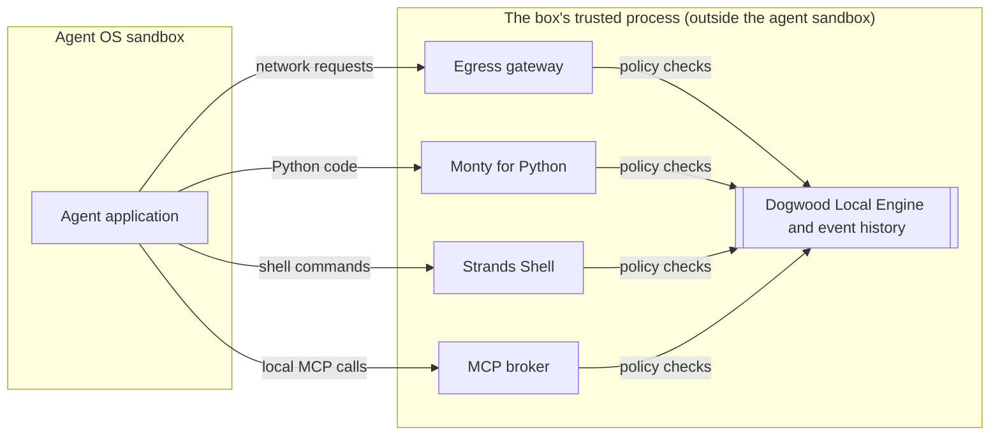

<div align="center">
  <div>
    <a href="https://strandsagents.com">
      <picture>
        <source media="(prefers-color-scheme: dark)" srcset="https://strandsagents.com/latest/assets/wordmark-github-dark.svg">
        
      </picture>
    </a>
  </div>

  <h1>Strands Box</h1>

  <h2>An open source sandbox engine for AI agents.</h2>

  <div align="center">
    <a href="https://github.com/strands-agents/box/graphs/commit-activity"></a>
    <a href="https://github.com/strands-agents/box/issues"></a>
    <a href="https://github.com/strands-agents/box/pulls"></a>
    <a href="https://discord.gg/Wa4CQrxsP"></a>
  </div>

</div>

<hr>

## Overview

Strands Box is an open source sandbox for AI agents.
It combines operating-system isolation with semantic policies
written in [Dogwood](https://dogwood-policy.github.io/dogwood/), so you can control
what agents can access and the conditions under which they can act.

Box is harness-agnostic. You choose the agent program or binary to run, configure
its access in `box.toml`, and write its policies in `policy.dw`.

The host OS enforces the direct access restrictions in `box.toml`. Strands Shell,
Monty for Python, the egress gateway, and the MCP broker send the operations
they handle to the embedded Dogwood Local Engine, which evaluates the rules in
`policy.dw`. Box enforces its allow or deny decisions outside the agent process.

Dogwood uses `permit` and `forbid` rules. Operations checked by the engine are
denied by default: a matching `permit` must allow the operation, and a matching
`forbid` overrides that permission.

Box's interpreters and gateways share an event history, so rules can use earlier
actions and elapsed time to decide what is allowed next. For example, a file read
through Shell or Python can cause the gateway to deny a later outbound HTTP request.

**Preview:** Box currently supports local execution on macOS with Apple silicon.
We welcome feedback through [GitHub issues](https://github.com/strands-agents/box/issues).
Read [CONTRIBUTING.md](CONTRIBUTING.md) before submitting a change.

## Key capabilities

- **File, program, and network restrictions.** The agent's sandbox limits its
  direct access. Box reports the configured grants at startup.
- **Semantic and temporal policies.** Dogwood rules can depend on the requested
  operation, its arguments, earlier actions, and elapsed time. Operations checked
  by the policy engine are denied unless a rule permits them.
- **Policy across code and tools.** Strands Shell, Monty for Python, the egress
  gateway, and the MCP broker use one policy engine and event history. A file read
  through one interpreter can affect whether a later network request is allowed.
- **Request and tool-call checks.** The egress gateway checks connections and
  HTTP requests, including their method and path. The MCP integration checks
  configured tool calls and their arguments.
- **Credential injection.** The gateway authenticates permitted requests with
  configured API credentials or AWS SigV4 signing. The agent does not receive the
  underlying secrets.
- **Decision records.** Box records policy decisions in OTLP JSON. By default,
  records go to `<box_dir>/private/telemetry/records.jsonl`.

Direct filesystem grants in `box.toml` are enforced by the OS and do not produce
individual Dogwood decisions. To apply a policy to file operations, use the
interpreters and keep those files out of the agent's direct grants. See
[filesystem access](docs/user/security.md) and [policy](docs/user/policy.md).

## Architecture

Box runs the Dogwood Local Engine and its enforcement components in its own
process, outside the agent's sandbox. Strands Shell, Monty, the egress gateway,
and the MCP broker check operations with the engine before allowing them.
They also record events that later policy decisions can use.



When the agent uses a program such as `git` or `cargo`, or a local MCP server,
Box checks the launch against policy and runs the program in its own sandbox.
You configure which files each program can read or change. The agent can send
requests to Box's interpreters, but external programs and local MCP servers
cannot. Box receives their output and exit status, and their
network traffic goes through Box's gateway by default. See the
[security model](docs/user/security.md) for details.

For each part, where it runs, what it decides, and how one request moves through them, read
[Box architecture](docs/design/architecture.md).

## Getting started

Follow the [getting-started guide](docs/user/getting-started.md) to run
Strands CLI with Box. You need a Mac with Apple silicon and
macOS 15 or later, Node.js 22.21 or later from Homebrew, and access to Claude
Opus 5 on Amazon Bedrock in `us-west-2`.

The download script checks the release checksum and unpacks the binaries into
`./box-core`. It does not change your `PATH` or system directories:

```sh
curl -fsSL https://raw.githubusercontent.com/strands-agents/box/main/download.sh | sh
./box-core/box --version
```

Keep the downloaded binaries together in `./box-core`.
You can also [build from source](#build-from-source). Then follow the guide to
write `box.toml` and `policy.dw`, and run the box.

### Change what the box allows

Edit `box.toml` to change the agent's environment and direct access grants. Edit
`policy.dw` to change the rules for operations Box checks through its interpreters
and gateways. You can give your coding agent the policy-authoring skill for help
with Dogwood syntax and Box's supported actions:

```
https://raw.githubusercontent.com/strands-agents/box/main/.agents/skills/authoring-box-policy/SKILL.md
```

## Examples

Run the [Strands Python SDK example](examples/strands-box/strands-sdk-agent/) for a small
agent whose three tools use Shell.

See the [example index](examples/README.md) for dependencies and run instructions.

## Build from source

This is a Cargo workspace. `rust-toolchain.toml` pins the compiler, and rustup
installs it on the first build. Build the box binaries from a clone with
[rustup](https://rustup.rs/):

```sh
git clone https://github.com/strands-agents/box.git
cd box
cargo build --release -p strands-box -p strands-box-containment
```

Run the compiled binary as `./target/release/strands-box`. Keep its helper
binaries in the same directory.

Common tasks run through [`just`](https://github.com/casey/just):

```sh
just build         # the CLI, the alias image, and the containment trampoline
just test          # workspace tests
just check         # pre-push gate: fmt-check + clippy + test
just test-all      # workspace tests and box example checks
```

`cargo test --workspace --all-features` runs the full suite. Include
`--all-features` to run the `box_shell` and `box_credentials` suites, which require
the `test-support` feature.

## Documentation

| Guide | Contents |
|---|---|
| [`docs/user/`](docs/user) | How to install Box and run a box. |
| [`docs/design/`](docs/design) | Architecture, enforcement boundaries, and design decisions. |

See [AGENTS.md](AGENTS.md) for the repository rules and the current state.

## Reporting a problem

Open an issue on this repository. For a suspected security problem, read
[SECURITY.md](SECURITY.md) first.

## License

Apache License 2.0.
