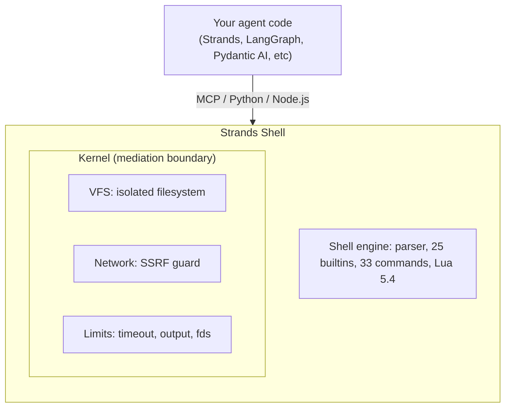

<!-- Modified by Amazon. Original source: https://github.com/strands-agents/shell. Local changes are recorded in crates/shell/UPSTREAM.md. -->

<div align="center">
  <div>
    <a href="https://strandsagents.com">
      
    </a>
  </div>

  <h1>
    Strands Shell
  </h1>

  <h2>
    Give your agent a shell without giving it the keys to your machine.
  </h2>

  <div align="center">
    <a href="https://pypi.org/project/strands-shell/"></a>
    <a href="https://www.npmjs.com/package/@strands-agents/shell"></a>
    <a href="#license"></a>
    <a href="https://discord.gg/strands"></a>
  </div>

  <p>
    <a href="https://strandsagents.com/docs/user-guide/shell/">Documentation</a>
    ◆ <a href="#mcp-server">MCP Server</a>
    ◆ <a href="#python">Python</a>
    ◆ <a href="#nodejs">Node.js</a>
  </p>
</div>

---

Agents run shell commands in fast loops: install dependencies, run tests, grep for errors, and repeat. Those loops need speed and isolation.

Strands Shell is a Bourne-compatible shell that runs in-process. It gives `grep`, `sed`, `jq`, `curl`, `find`, and more than 50 other commands, with no fork, no exec, no direct syscall, and no cold start. You declare which files the agent reaches. The agent cannot see anything else.

| | Docker | Cloud sandbox | Strands Shell |
|---|---|---|---|
| **Cold start** | ~200ms | ~1s (network) | <1ms |
| **Isolation** | Container namespace | MicroVM | In-process VFS |
| **Network** | iptables / sidecar | Platform policy | On/off switch + SSRF guard |
| **Secrets** | Env vars (agent can read them) | Platform-specific | The shell holds none, so the agent never sees one |
| **Setup** | Docker daemon | API key + network | `pip install strands-shell` |
| **Platforms** | Linux | Cloud-only | macOS, Linux, WASM |

## Quick Start

### MCP (works with any agent framework)

Drop this into your MCP client config:

```json
{
  "mcpServers": {
    "shell": {
      "command": "uvx",
      "args": ["strands-shell", "--mcp"]
    }
  }
}
```

Your agent then gets four tools: `shell`, `read_file`, `write_file`, and `list_dir`. The Kernel mediates all four.

### Python

```bash
pip install strands-shell
```

```python
import strands_shell

shell = strands_shell.Shell(
    binds=[strands_shell.Bind("/my/project", "/workspace", mode="copy")],
)

out = shell.run("grep -rn TODO /workspace")
print(out.stdout)
```

### Node.js

```bash
npm install @strands-agents/shell
```

```javascript
import { Shell } from '@strands-agents/shell'

const shell = await Shell.create({
  binds: [{ source: '/my/project', destination: '/workspace', mode: 'copy' }],
})
const out = await shell.run('grep -rn TODO /workspace')
console.log(out.stdout)
```

## How It Works



Written in Rust, with native bindings for Python (PyO3) and Node.js (napi-rs). State persists across `run()` calls (env vars, working directory, functions). The filesystem is shared.

## Configuration

```python
shell = strands_shell.Shell(
    binds=[
        strands_shell.Bind("/host/project", "/workspace", mode="copy"),
        strands_shell.Bind("/tmp/output", "/output", mode="direct"),
    ],
    timeout=30.0,
    env={"PROJECT": "demo"},
    limits=strands_shell.Limits(
        max_output=1 << 20,
        max_file_size=10 << 20,
    ),
)
```

> ⚠️ **`mode: "direct"` mounts are live.** The agent can read and modify host files in real time. Use only for designated output directories. Never direct-bind directories containing secrets or configuration you don't want the agent to modify.

### Inspecting configuration

A constructed shell exposes a read-only snapshot of how it was configured. This
is useful when you embed Strands Shell as a sandbox in a larger framework and
need to build tool descriptions or report the active resource caps from a shell
object you were handed.

```python
shell = strands_shell.Shell(
    binds=[strands_shell.Bind("/my/project", "/workspace", mode="copy")],
    timeout=30.0,
)

cfg = shell.config           # a frozen ShellConfig snapshot
cfg.binds[0].destination     # '/workspace'
cfg.timeout                  # 30.0
```

```javascript
const shell = await Shell.create({
  binds: [{ source: '/my/project', destination: '/workspace', mode: 'copy' }],
  timeout: 30,
})

const cfg = await shell.config()   // a deep-frozen snapshot object
cfg.binds[0].destination           // '/workspace'
cfg.timeout                        // 30
```

The snapshot reports binds, environment variables, umask, timeout, resource
limits, and whether the network is enabled.

### TOML

You can load all of this from a config file instead:

```toml
[[bind]]
mode = "copy"
source = "/host/project"
destination = "/workspace"

[[mcp]]
name = "my-tools"
command = "/path/to/mcp-server"
args = ["--stdio"]
```

## MCP Server

The built-in [MCP](https://modelcontextprotocol.io/) server exposes the shell over JSON-RPC on stdio, working with anything that speaks MCP.

```sh
uvx strands-shell --mcp                          # bare in-memory sandbox
uvx strands-shell --config sandbox.toml --mcp    # with mounts
```

If you declare `[[mcp]]` servers in your TOML config, they show up as Lua modules inside the shell. Call `require("my_tools")` and you get a table of the server's tools.

## Security Model

> **Strands Shell is a mediation layer, not a security sandbox.** It enforces what the agent *should* access via Kernel-mediated deny-by-default. It does NOT protect against: memory-safety exploits in the shell engine itself, timing side-channels, or an attacker who controls the host process. For multi-tenant or adversarial workloads, run each Shell instance inside a container or microVM.

The Kernel mediates everything; it runs in the same process as your code, not in a VM. If your threat model is "untrusted tenant running arbitrary code," put Strands Shell inside a container too. For "my agent shouldn't access things I haven't explicitly allowed," the Kernel handles it.

**Default-deny. You allowlist what the agent can reach:**

- Files: only bound paths exist, everything else is hidden.
- Network: `curl` blocks private ranges (RFC1918, link-local, loopback, IMDS) unconditionally while letting public URLs pass through. This floor is deny-only; it is not the authorization decision. The shell does not decide egress at all — the effect interceptor sees command and filesystem attempts, never a network attempt. Turn outbound HTTP off entirely with `disable_network()`, or route the host process through an egress boundary you control and decide there.
- Secrets: the shell holds none, so the agent never sees one. Credential injection belongs to the egress boundary you route the process through.
- Syscalls: there are none; no `fork`, no `exec` because the shell is pure userspace.

If you bypass any of these, report it. See [SECURITY.md](SECURITY.md).

**Limits (best-effort):** timeouts, output caps, fd limits, inode limits. They bound a runaway agent. They do not stop an attacker who tries to break out. Use OS-level isolation for that.

**Multi-tenant:** a Shell instance is single-owner. If you serve more than one agent, create one Shell per agent. Construction is cheap — no container, no VM, only an in-memory VFS — so one Shell per request is the intended pattern.

### Secure Defaults

Out of the box, the shell is an empty sandbox — no files and no reachable internal network. When you grant access, follow least privilege:

- **Prefer `mode: "copy"` over `mode: "direct"` for source code.** Copy-on-create isolates the agent from your live files. Use `direct` only for output directories where the agent needs to persist results.
- **Scope binds narrowly.** Bind `/my/project/src` rather than `/my/project` or `/`. The agent doesn't need your `.git/`, `.env`, or `node_modules/`.
- **Authorize destinations at your egress boundary.** The SSRF floor only blocks internal ranges. The shell does not decide which public hosts the agent may reach, so decide that where the traffic leaves the host process — or call `disable_network()` and grant no egress at all.
- **Keep the timeout.** The builder already bounds each command at 30 seconds. Set `timeout` only when a workload needs a different bound, and remember that a larger value lets one command hold the process longer.
- **Keep the limits.** `max_output` already caps one command's output at 1 MB, and `max_file_size` at 10 MB. Lower a cap for a tighter agent loop; raise one deliberately.

## Commands

25 builtins, 33 commands, and a Bourne-compatible shell with pipes, loops, functions, and subshells.

The commands agents use constantly: `grep`, `find`, `cat`, `head`, `tail`, `jq` for reading and searching. `sed`, `sort`, `tr`, `cut` for transforming output. `cp`, `mv`, `rm`, `mkdir` for file management. `curl` for HTTP (SSRF-guarded). `lua` for a script that shell syntax makes awkward.

The [full command reference](https://strandsagents.com/docs/user-guide/shell/commands/) has the inventory with implementation status, supported flags, and known gaps vs GNU coreutils.

## File Operations API

Read and write files without going through a shell command:

```python
shell.write_file("/workspace/note.txt", b"hello")
data = shell.read_file("/workspace/note.txt")
entries = shell.list_files("/workspace")
shell.remove_file("/workspace/note.txt")
```

## Contributing

See [CONTRIBUTING.md](CONTRIBUTING.md). Bug reports and design questions are just as useful as PRs.

## Community

Join [Discord](https://discord.com/invite/strands) to discuss the project.

## License

Apache-2.0

## Security

If you find a security issue, report it privately instead of opening a public issue. Bypasses of filesystem mediation, the effect-admission seam, or SSRF protection qualify. See [SECURITY.md](SECURITY.md).
