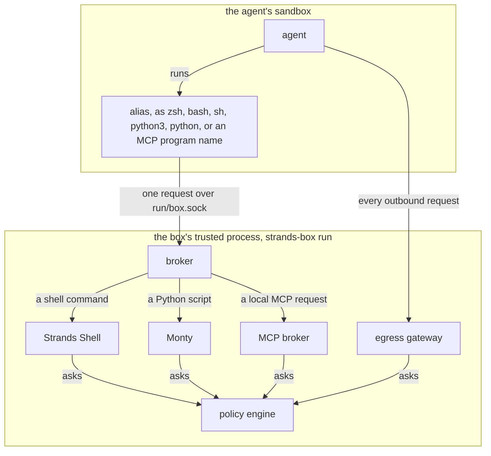
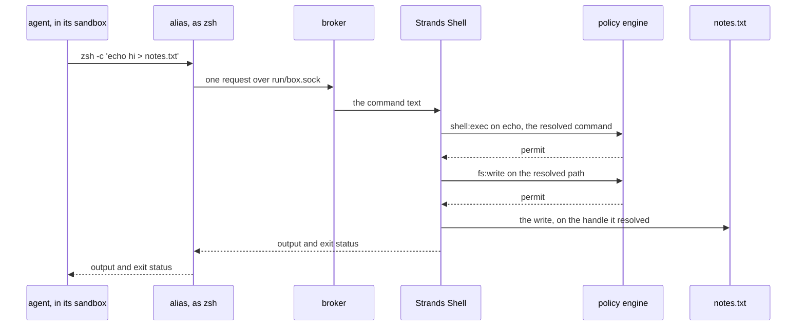

# Box architecture

A box has three parts: the agent's sandbox, a sandbox for each tool or local MCP server, and the
box's trusted process, which runs outside every sandbox. Box enforces two things across them.
**Operating system enforcement** bounds what each sandboxed process reaches with its own system
calls, and the operating system applies it. **Policy** decides each request the agent sends to the
box's trusted process. [How Box contains a process](containment.md) covers the first in depth, and
[policy](policy.md) the second.

This page names the parts of a box, says where each one runs and what it decides, follows one shell
command from the agent to the file it touches, and gives the order a run brings the parts up and
takes them down. For which risks belong to Box and which to the operator, read
[security model and shared responsibility](security.md).

## The parts

### The box's trusted process

The box's trusted process is `strands-box run` itself. The operator starts it, it starts everything
else, and it never runs inside a sandbox. It holds the policy engine and the four enforcement points
that ask it: Strands Shell, Monty, the egress gateway, and the MCP broker. Beside them, the broker
routes each request from the agent to the right enforcement point, and the collector records each
decision. Two more parts sit at the boundary: the trampoline, which applies a sandbox and then
becomes the contained program, and the alias, the one Box program inside the agent's sandbox.

One `run` is one box. It holds that box's policy engine, its interpreters, its gateway, its
certificate authority, and only that box's secrets. A shared process would hold every box's
plaintext secrets and signing keys in one address space, where one memory-safety failure reaches them
all ([each box has one trusted process](decisions.md#one-trusted-process-per-box)). It holds an
exclusive lock on a file inside the box directory for its whole life, so a second `run` against the
same box directory refuses rather than opening a second engine ([one `run` owns one box
directory](decisions.md#one-run-owns-one-box-directory)). Box needs no verb to stop or delete a box:
the caller ends the process, and removes the directory.

### The policy engine

The policy engine decides every request the workload makes through the trusted process, and it is the
only authorizer. No other part holds a verdict of its own ([the authored policy is the only decision
authority](decisions.md#the-authored-policy-is-the-only-decision-authority)). A box whose policy
grants nothing starts, and then refuses every effect.

There is exactly one engine per box, and every enforcement point shares it ([a box has exactly one
policy engine](decisions.md#one-policy-engine-per-box)). That one shared history is what lets a rule
connect a file read through the Shell with a later request through the gateway. The history belongs
to the box rather than to the run, so it carries across runs ([history is durable per
box](decisions.md#history-is-durable-per-box-and-has-no-rewind)). [Policy](policy.md) covers how a
request is decided and what a history rule can see.

### The broker

The broker accepts the alias's connections on `run/box.sock`, in the box directory, and it
authorizes nothing itself. It has three legs, one for each kind of request: Strands Shell takes a
shell command, Monty takes a Python script, and the MCP broker takes a request to a local MCP server.
The broker checks the protocol version, reads which leg the request named, and hands the request
over.

The alias is part of the workload, so the broker treats every alias as hostile ([an interpreter runs
beside the workload](decisions.md#interpreters-are-brokered-aliases)).

### Strands Shell

[Strands Shell](shell.md) runs every shell command the agent issues, and it is where a command
becomes a decision. It raises `shell:exec` on the resolved command, then an `fs:*` action for each
file that command touches. A program the Shell does not implement raises `shell:spawn` and runs in
its own sandbox, separate from the agent's ([the sandboxes](#the-sandboxes)).

### Monty

[Monty](monty.md) runs Python, and it performs no I/O of its own. Each file operation a script makes
pauses the interpreter, Box decides it, and Box performs only what policy permits. A script reaches
the network through one function.

Neither interpreter keeps state across a call, so a variable exported in one command is unset in the
next ([no interpreter state crosses a call
boundary](decisions.md#no-state-crosses-a-call-boundary)). Both run in the trusted process, beside
the policy engine, the certificate authority key, and the resolved secrets. That placement is stated
residual risk: what makes it acceptable is mediation rather than memory safety, so a memory defect in
either interpreter is code execution in the trusted process ([both interpreters run in the trusted
process](decisions.md#the-interpreters-run-in-the-trusted-process)).

### The egress gateway

The gateway is the box's only route out. Box points every sandboxed process at it with the standard
proxy environment variables (`HTTPS_PROXY` and its siblings), and the sandbox holds each process to
it, so a client that ignores those variables reaches nothing. A tool or a stdio MCP server for which
the operator declares a network exception is the one way past it, and that exception is stated
residual risk ([a declared network
exception](decisions.md#native-egress-is-an-operator-declared-leaf-escape)). The gateway terminates
each connection, which is why no tunnel is opaque to the boundary ([the gateway terminates every
connection](decisions.md#no-connection-is-opaque-to-the-boundary)). It raises `net:connect` for each
destination and `http:request` for each request, and it holds no allow list of its own.

The gateway is also where a credential is added, because the workload never holds one. The workload
gets a placeholder, and the gateway swaps in the real secret on a permitted request to the destination
the operator bound it to ([the workload holds a phantom
token](decisions.md#the-workload-holds-a-phantom-and-the-gateway-holds-the-secret),
[how Box keeps credentials out of the box](credentials.md)). A binding reaches nothing by itself:
policy still decides the connection and the request, so each destination needs its own permit ([a
credential binding is
configuration](decisions.md#a-credential-binding-is-configuration-not-a-policy-action)).
[How Box controls outbound traffic](egress.md) covers the route and the decisions.

### The MCP broker

The MCP broker is the broker's third leg. The other two legs are interpreters. The MCP broker is the
broker's own code, and it is the enforcement point for a request to a local MCP server. Each stdio
server runs in its own sandbox, separate from the agent's, and it starts only when the agent runs
the server's alias and a `shell:spawn` permit admits it ([every MCP server is one configuration
table](decisions.md#an-mcp-server-is-one-configuration-table)). After that, the MCP broker raises
`mcp:call` on each request the agent sends to the server. A permit on `mcp:call` covers every tool
on that server, and a rule on a tool's own action can narrow it ([an MCP tool call passes two
gates](decisions.md#mcp-authorization-is-two-gates)). A remote MCP server takes the gateway's route
instead, and the gateway raises the same `mcp:call`. [How Box runs MCP servers](mcp.md) covers both
routes.

### The collector

Every box records each decision it takes, by default, to a file the workload cannot reach ([the
default target](decisions.md#every-box-records-by-default)). The enforcement point submits the
record, not the engine, so what the record names is the decision as it was enforced, including a
reachable paths check that overrode a permit ([the canonical
record](decisions.md#the-effective-decision-is-the-canonical-record)).

The collector also receives the agent's own spans, which makes it the one part of the trusted process
the workload can post to. [Telemetry](telemetry.md) covers what that costs and why the workload can
neither forge a record nor suppress one.

### The trampoline

Sandboxing on macOS is one-way: the call that applies a sandbox locks down the process that makes
it, permanently. So the trusted process never makes that call for itself. It starts
`strands-box-contain-trampoline`, which applies the sandbox to itself and then becomes the target
program, already contained and unable to undo it ([one trampoline spawns every contained
process](decisions.md#one-trampoline-spawns-every-contained-process)). The trampoline decides
nothing: which rules a process gets is written in the configuration it is handed.
[The box binaries](binaries.md) covers how Box verifies the trampoline before it runs one.

### The sandboxes

A box has two kinds of sandbox, and the trampoline applies both.

**The agent's sandbox** starts with the run, and no policy decision admits it. It's the narrowest:
the agent can run its own `command` and each program its `exec` list names, and nothing else. It's
also the only sandbox with a route back to the box's trusted process, through the aliases and
`run/box.sock`.

**A tool's sandbox, or a local MCP server's sandbox,** starts only when a `shell:spawn` permit admits
the program. It takes its filesystem grants from its own `[tool.<name>]` or `[mcp.<name>]` table,
never from the agent's, and it's wider than the agent's sandbox. It gets no alias and no route to
`run/box.sock`, so the program inside it can't ask Box to act for it. Its own file operations raise
no `fs:*` decision, so its filesystem grants are what bound them, and one `shell:spawn` decision
covers the whole process tree. Its network traffic still goes through the egress gateway, unless
the operator declares a network exception for it ([a host
binary runs in its own
sandbox](decisions.md#a-host-binary-runs-in-a-leaf-box-and-the-policy-is-the-only-allowlist)).
[How Box contains a process](containment.md#the-agents-box-and-leaf-boxes) covers how the two
differ.

### The alias

A harness expects to run a shell and Python from its `PATH`, and Box's interpreters run outside the
sandbox. The alias bridges that, and it holds no power of its own: it can't open the policy, and it
can't serve a request. Box places it in the box directory's `bin/` as `zsh`, `bash`, `sh`,
`python3`, and `python`, and as one name for each local MCP server, taken from the server's program.
Nothing a caller passes can point it at another socket ([the box binaries](binaries.md)). A tool's
sandbox and a local MCP server's sandbox get no alias, so a `python3` there is the host OS's
Python.

## How the parts fit together

| Part | Runs in | Lifetime | What it decides |
|---|---|---|---|
| The box's trusted process | Outside every sandbox | The whole run | Nothing itself. It holds everything that decides. |
| Policy engine | The trusted process | The whole run, over history that outlives it | Every mediated request |
| Broker | The trusted process, its own thread | The whole run | Nothing. It routes each request. |
| Strands Shell | The trusted process | One command | Asks policy: `shell:exec` or `shell:spawn`, then `fs:*` per effect |
| Monty | The trusted process | One script | Asks policy: `fs:*` per file operation |
| Egress gateway | The trusted process | The whole run | Asks policy: `net:connect`, `http:request`, and `mcp:call` for a remote server |
| MCP broker | The trusted process, within the broker | The whole run | Asks policy: `shell:spawn` to start a local MCP server, then `mcp:call` per request |
| Collector | The trusted process | Opened before the box, drained after it | Nothing |
| Trampoline | Outside the sandbox | Until it becomes the contained program | Nothing |
| Alias | Inside the agent's sandbox | One command, or one MCP connection | Nothing |

Every route the workload has ends at the same engine:

Each enforcement point acts only after a permit: Strands Shell and Monty perform the file
operation, the MCP broker relays the request to the server, and the gateway forwards the request.

## One command, from the agent to the file

Suppose policy permits `shell:exec` and `fs:write` in the workspace, and the agent runs
`zsh -c 'echo hi > notes.txt'`.

Four things in that path carry the design.

**One command raises more than one decision.** The decision is on `echo`, the command the Shell
resolved, and not on the `zsh` the agent typed. Then each effect that command has raises its own
decision. The redirect is a write, so a policy that permits the command and refuses the write fails
the command before `echo` runs.

**The path is resolved before it is judged.** The Shell resolves `notes.txt` against the working
directory, follows each symlink, and raises the decision on what it resolved. Then it performs the
effect on the object it resolved rather than on the name, so swapping a symlink between the decision
and the effect diverts nothing ([a resolved token binds the object it
names](decisions.md#a-resolved-token-binds-the-object-it-names)).

**A deny-only check runs after the permit.** On the interpreter path the reachable paths check runs
after policy and can only subtract ([a deny-only check cannot be
widened](decisions.md#the-authored-policy-is-the-only-decision-authority)). It refuses a path
outside the operator's home, the agent's home, and the workspace, a path inside the box directory,
and the configuration and policy this run loaded, whatever a permit says. It does not protect
credentials: the Shell can name anything under the operator's home, so an `fs:read` permit with no
path condition reads `~/.ssh` ([nothing beneath the interpreters protects
credentials](decisions.md#no-credential-floor-sits-beneath-the-interpreters)). Scope every rule by
path. [How Box runs shell commands](shell.md) covers what the check refuses.

**The trusted process performs the effect.** The workload holds a socket and nothing else. That is
what puts the file operation on a path a decision can cover, and it is also why the interpreters are
part of what you have to trust.

## How a run comes up, and how it ends

`strands-box run` brings the parts up in a fixed order, and each step can refuse the box:

1. **It hardens itself first**, refusing a same-user process its address space. This is defence in
   depth rather than a guarantee, and root bypasses it ([the trusted process refuses another process
   its address space](decisions.md#the-trusted-processs-memory-is-a-defended-asset)).
2. **It reads `box.toml`, prepares the box directory, and takes the run lock.** It records the
   canonical path and the filesystem identity of each file it opened, and every later step acts on
   that identity rather than on the name, so replacing a file afterwards changes nothing ([a run
   validates once, then acts on the identity it
   approved](decisions.md#a-run-validates-once-then-acts-on-the-identity-it-approved)).
3. **It opens the collector**, so every step that follows has somewhere to record.
4. **It installs the policy.** A policy that does not parse or does not validate refuses the box. A
   rule the load can prove will never fire is also refused, and a rule that might fire warns ([a rule
   that cannot fire is refused at
   load](decisions.md#a-rule-that-cannot-fire-is-refused-at-load-and-an-uncertain-one-warns)).
5. **It checks each credential daemon the configuration names**, so a missing daemon fails here
   rather than at the first signed request ([`box run` validates a `credsd` setup before it starts the
   workload](decisions.md#box-run-validates-a-credsd-setup-before-the-workload-starts)).
6. **It resolves each bound secret, starts the gateway with its own certificate authority, judges
   each process specification's filesystem reach once, and binds the broker socket.** An unjudgeable
   grant refuses the box here.
7. **It builds each sandbox's grants and discloses them**, each tool first and then the agent.
   Every direct filesystem grant is printed to stderr, because no `fs:*` decision will cover one
   ([direct filesystem reach is declared and
   disclosed](decisions.md#direct-filesystem-reach-is-declared-and-disclosed)). A tool that cannot be
   translated refuses the box before the agent exists.
8. **It starts the trampoline**, which becomes the agent, and then it waits.

Teardown runs in the reverse direction, and the order is the point. The workload is reaped first, so
nothing contained is alive while the box's authority is still up. Then the broker unbinds, the gateway
finishes, the record that names the running box is withdrawn, and the lock releases last among the
box's own authority, so no second run takes the box while any of it is still serving. The collector
drains after that, and the drain is what exports, so the export outlives the lock.

## Why this shape

### The boundary is the operating system's own sandboxing

Box contains the workload with what the surrounding OS already has, and boots no guest operating
system. A microVM is the stronger boundary, and Box still does not use one, because the workload has
to do its job in the operator's own environment, at the paths that environment already uses. The cost
is that a kernel escape defeats operating system enforcement ([the boundary is the surrounding OS's own
sandboxing](decisions.md#the-boundary-is-the-surrounding-os-not-a-virtual-machine)).

### Box decides outside the harness

Many harnesses ship an allow list and an approval prompt of their own. Box neither relies on one nor
reads one, because a check inside the agent's own process is a floor and never a wall, and because it
judges the tool call rather than its effect ([Box decides outside the
harness](decisions.md#box-decides-outside-the-harness)).

## See also

- [Security model and shared responsibility](security.md): which risks belong to Box, the operator,
  and the surrounding environment.
- [How Box contains a process](containment.md): what a sandbox guarantees and where its reach comes
  from.
- [The box binaries](binaries.md): what each of the three binaries is and where it runs.
- [Policy](policy.md): how one engine decides each request, and what its history guarantees.
- [How Box runs MCP servers](mcp.md): the two decisions a server needs, and how Box learns its tools.
- [How Box keeps credentials out of the box](credentials.md): where each secret sits, and how the
  gateway puts it on a request.
- [Telemetry](telemetry.md): what a box records, and what the workload cannot do to it.
- [Limits of Box's protection](limitations.md): what an allowed action can still do.
- [Decisions](decisions.md): the reason for each part of this design, by anchor.
