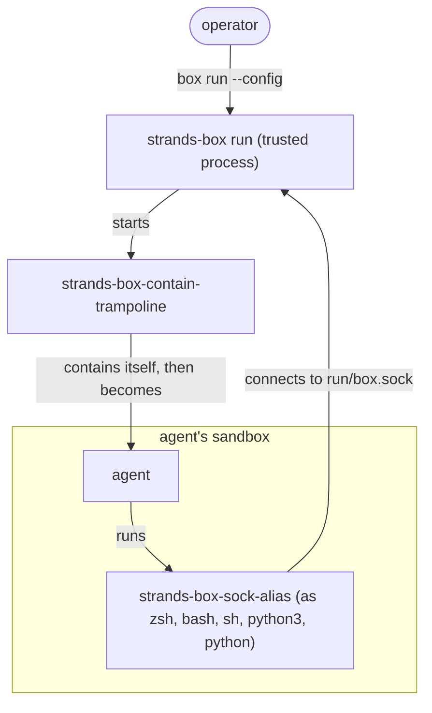

# The box binaries

A box runs on three binaries. One stays outside the box and makes every decision, one puts the
workload into the box, and one sits inside the box so the workload has something to talk to.

## The three binaries

- `strands-box` is the entry point and the [trusted process](terminology.md). The operator starts
  it, it starts everything else, and it never runs inside a box.
- `strands-box-contain-trampoline` starts each workload inside its box.
- `strands-box-sock-alias` lets the workload reach the interpreters from inside the box.

The release archive ships `strands-box` under the name `box`, so the operator types `box run`. This
page uses the binary's real name.

### Box - `strands-box`

`strands-box` is the entry point, and it starts everything else. When the operator runs `box run`,
`strands-box` reads the box's configuration and policy, sets up the box directory, and starts the
egress gateway and the broker. Then it uses `strands-box-contain-trampoline` to start the agent
inside its box, and it stays running until the agent exits.

While it runs, `strands-box` holds everything that makes a security decision: the policy, the
egress gateway, and the interpreters that run shell and Python commands for the workload. None of it
runs inside the box, so the workload can't access it; the workload can only send a request over a socket, and
`strands-box` decides what happens to it. Each box gets its own `strands-box run` process
([one trusted process per box](decisions.md#one-trusted-process-per-box),
[the interpreters run in the box's trusted process](decisions.md#the-interpreters-run-in-the-trusted-process)).

It expects `strands-box-contain-trampoline` and `strands-box-sock-alias` to sit next to it. If one
is missing when it's needed, `strands-box` stops.

### Trampoline - `strands-box-contain-trampoline`

A sandbox on macOS is one-way: `sandbox_init` locks down the process that calls it, for good.
`strands-box-contain-trampoline` (the trampoline) makes that call, so `strands-box` never contains
itself and stays the box's trusted process.
`strands-box` starts one trampoline for the agent, and one for each program Box starts in a
[separate sandbox](terminology.md): every host binary that a `shell:spawn` permit lets through, and
every stdio MCP server
([the sandbox ends with the contained process](decisions.md#containment-ends-with-the-contained-process),
[one trampoline spawns every contained process](decisions.md#one-trampoline-spawns-every-contained-process)).

`strands-box` hands the trampoline its sandbox grants as an already-open file, plus a
SHA-256 digest of the contents. The trampoline reads the open file rather than the path, so swapping
the file on disk afterwards changes nothing, and it checks the digest before it parses anything
([the configuration crosses the exec boundary bound by a digest](decisions.md#the-configuration-crosses-exec-as-digest-bound-json)).
Then it locks itself down and turns into the target program, keeping only the environment that
`strands-box` built for it. The target starts already contained and can't undo it.

The trampoline doesn't decide anything itself. Whether a process gets the agent's rules or the rules
for a tool's or local MCP server's sandbox is written in the configuration, and `strands-box` writes
that.

Anyone who can write to the install directory could swap the trampoline, so `strands-box` doesn't
trust the path. Every time it starts a contained process, it opens the trampoline and checks that
the open file is a native executable carrying the marker the build embeds. Then it copies those
exact bytes into `private/trampoline/`, names the copy by its SHA-256 digest, and runs the copy.

### Alias - `strands-box-sock-alias`

Agent harnesses expect to find `zsh` and `python3` on their `PATH`, but the real interpreters run
in `strands-box`, outside the box. `strands-box-sock-alias` (the alias) bridges that gap. It's the
only Box program inside the box, and it has no power of its own: it can't open the policy, and it
can't serve requests.

`strands-box` puts the alias in the box directory's `bin/` under the names `zsh`, `bash`, `sh`,
`python3`, and `python`, plus the program name of each MCP server the box declares. `bin/`
comes first on the agent's `PATH`, so when the harness runs `zsh`, it gets the alias. The sandbox for a
tool or a local MCP server gets no alias and no `bin/` on its `PATH`. The alias uses the name it was run under to tell `strands-box` which interpreter or MCP server the
request is for. It connects to `run/box.sock`, a path it works out from where it lives, and nothing the
caller passes can point it anywhere else. The broker inside `strands-box` takes it from there
([an interpreter runs beside the workload](decisions.md#interpreters-are-brokered-aliases)).

The alias is part of the workload, so it's untrusted, and the broker treats every alias as
hostile
([the broker protocol](decisions.md#the-broker-protocol-is-framed-versioned-and-refuses-with-a-reason-code)).

`strands-box` places the alias with a hard link, or a copy when `bin/` is on a different file
system. It records the size and modification time of the installed file in
`private/alias-image.stamp`, and puts fresh copies in place when either changes. The alias and the
broker are built from the same protocol code, and the broker refuses a request with a different
protocol version.

## How the three fit together

| Binary | Where it runs | Started by | Lifetime |
|---|---|---|---|
| `strands-box` | Outside every box, as the box's trusted process | The operator, as `box run` | The whole run |
| `strands-box-contain-trampoline` | Outside the box, until it contains itself and becomes its target | `strands-box`, once for each contained process | Until it becomes its target |
| `strands-box-sock-alias` | Inside the box | The workload, as `zsh`, `bash`, `sh`, `python3`, `python`, or an MCP program name | One shell or Python command, or one MCP connection |

## See also

- [Getting started](../user/getting-started.md): download the binaries and run an agent in a box.
- [Decisions](decisions.md): the reason for each part of this design, by anchor.
- [Terminology](terminology.md): the terms this page uses, such as trusted process, sandbox, and alias.
