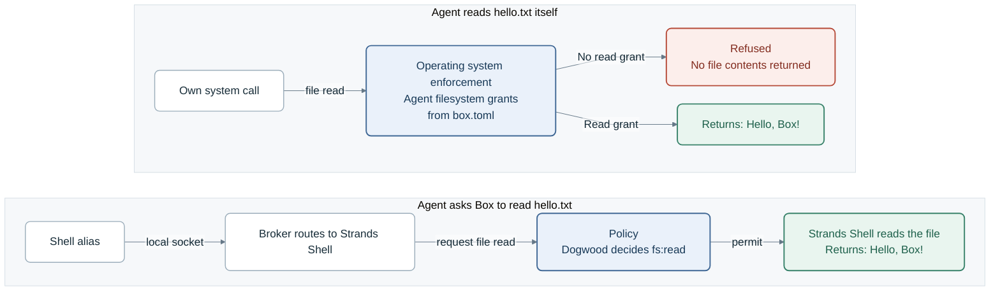

# How Box contains a process

Box runs the agent inside a **box**: the complete boundary around the agent and the resources it
can reach. The part of a box that the operating system enforces is its **sandbox**, and it bounds
every system call the agent makes. Each tool and each local MCP server the agent uses runs in
**its own sandbox**, separate from the agent's. This page explains how the agent reaches a resource,
what a box guarantees, where a box's reach comes from, how the agent's sandbox differs from the
sandbox for a tool or a local MCP server, and what sits outside operating system enforcement.

Box runs on macOS today, where Seatbelt enforces each sandbox. Where a property comes from the macOS
backend, this page says so. [macOS enforcement](macos-enforcement.md) explains how Seatbelt does it.

> **Platform scope.** This page describes operating system enforcement on macOS. Its guarantees do not describe
> Linux behavior.

## Two kinds of enforcement

Box restricts the agent in two ways, and they cover different paths to a resource:

- **Operating system enforcement** bounds the system calls a process makes itself.
- **Policy** decides each request the agent sends to Box.

| | Operating system enforcement | Policy |
|---|---|---|
| What it covers | A process's own system calls, such as opening a file. | Requests the agent sends to Box: a Strands Shell command, a Monty script, an MCP tool call, and every outbound network request. |
| Who enforces it | The operating system's kernel. | A component in Box's trusted process, which asks the Dogwood policy engine. |
| Where it comes from | `box.toml` and the system paths a process needs to run. | `policy.dw`. |
| When it's decided | Once, before the process starts. | On every request. |

**How the agent sends a request to Box.** The agent's sandbox holds a few **aliases**: programs named
`zsh`, `bash`, `sh`, `python3`, `python`, and one per declared MCP server. When the agent runs one,
the alias forwards the request over a local socket to the **broker** in Box's trusted process. The
broker hands it to Strands Shell (Box's shell interpreter), Monty (Box's Python interpreter), or the
MCP server. The alias itself authorizes nothing. Outbound network traffic takes its own route,
through the egress gateway.

So the same file can be reached two ways. Suppose `hello.txt` in the workspace contains
`Hello, Box!`, and policy permits Strands Shell to read it:

In the top row, only the agent's grants decide. In the bottom row, only the `fs:read` decision does.

**Neither one changes the other.** A policy permit doesn't let the agent read the file with its own
system call. A `forbid` doesn't take away a filesystem grant either, because no policy decision
covers that access. Policy stays the only authorizer, and operating system enforcement stays beneath it
([the sandbox applies its grants and evaluates no policy](decisions.md#containment-evaluates-no-policy)).

**Why the agent gets direct grants at all.** A harness's built-in file tools make their own
system calls. Without direct grants, an unmodified harness can't
edit a file ([direct reach is declared and disclosed](decisions.md#direct-filesystem-reach-is-declared-and-disclosed)).

## What a box guarantees

A box makes five guarantees:

- **Fixed before the process starts:** Box reads `box.toml`, adds the system paths the process
  needs, and writes one set of sandbox grants. It runs no program to do this, and the
  grants never change while the box runs
  ([fixed and built without running a program](decisions.md#containment-is-fixed-and-built-without-running-a-program)).
- **Applied before the program runs:** a small launcher, `strands-box-contain-trampoline`, applies
  the sandbox to itself and then starts the configured program
  ([one trampoline spawns every contained process](decisions.md#one-trampoline-spawns-every-contained-process)).
  If the apply fails, or Box can't confirm the sandbox attached, the program doesn't start. There's
  no weaker fallback and no uncontained mode
  ([every failed apply refuses the workload](decisions.md#every-failed-or-unsupported-apply-refuses-the-workload)).
- **Closed by default:** a configuration starts with no filesystem grants and no network. A field
  the operator leaves out keeps the closed value
  ([an omitted field keeps the closed default](decisions.md#the-closed-choice-is-the-default)).
- **Inherited by children:** every process the contained program starts is bound by the same box,
  through every generation, and replacing the program with another one keeps it. Nothing widens a
  box after it applies ([children inherit the boundary](decisions.md#children-inherit-the-boundary)).
- **Protects the surrounding OS from the box:** the sandbox protects the operator's files,
  credentials, and network from what runs inside. It doesn't make the box's own contents
  confidential, and it doesn't govern code the agent writes and gets run somewhere else
  ([the sandbox protects the surrounding system](decisions.md#box-protects-the-machine-not-the-box)).

## Where a box's reach comes from

Box works out a box's reach in four steps:

1. **The process specification:** what the operator wrote in `box.toml`.
2. **The runtime minimum:** the system paths every process needs to start.
3. **The role:** what Box adds for the agent, a tool, or a local MCP server, which
   [the next section](#the-agents-box-and-leaf-boxes) covers.
4. **The floors:** paths Box refuses whatever the first three say.

### The process specification

`[agent]` and each `[tool.<name>]` hold the same four fields, and a stdio `[mcp.<name>]` entry holds
the same four plus `network`. One translator turns each of them into a set of sandbox grants
([one process specification and one translator](decisions.md#one-process-spec-and-one-translator)).

- **`command`:** the program to run, and its fixed leading arguments.
- **`workspace`:** the starting directory. It grants nothing: the process can enter it, and can't
  read it until a list names it.
- **`env`:** the variables the process gets. Box doesn't pass on the environment of the host OS's shell:
  only `HOME` and `PATH` come from it, unless `env` sets them, and Box adds its own names, such as
  the proxy and certificate variables. `HOME` is the
  operator's own home unless `env.HOME` names another directory, and a home grants nothing either
  ([`HOME` is the operator's own home](decisions.md#home-is-the-operators-and-the-workspace-is-entered)).
- **`filesystem`:** lists that name paths and access. The agent takes eight: `read`, `write`,
  `read_file`, `write_file`, `list`, `metadata`, `exec`, and `deny`. A tool and a local MCP server
  take the same lists without `metadata` and `exec`. A directory entry covers its tree, and a file
  entry is exact. `write` doesn't imply `read`.

### The runtime minimum

Box adds the system paths a process needs to start. There are two sets: the agent set and the
toolchain set. The agent set is small: the null device, time zone data, and the system libraries.
The toolchain set adds what a compiler or version control tool reads, such as locale data, linker
caches, and the certificate authority bundle. The agent gets only the agent set, and a tool or a local MCP server
gets both ([the runtime minimum is two sets](decisions.md#the-runtime-minimum-is-two-sets-and-the-agent-takes-the-smaller-one)).
A path the surrounding OS does not have is left out.
Each platform's paths are listed in
[`os-paths.macos.json`](../../crates/containment/src/containment-data/os-paths.macos.json) and
[`os-paths.linux.json`](../../crates/containment/src/containment-data/os-paths.linux.json).

### The floors

Box refuses some grants whatever the configuration says
([the deny-only floors](decisions.md#the-deny-only-floors-run-beneath-every-backend)). The floors
include:

- **Credential stores:** `~/.aws`, `~/.ssh`, keychains, and browser profiles, when a grant encloses
  them. An operator can still name one exactly, and Box reports that grant at startup
  ([one forbidden-path list](decisions.md#one-forbidden-path-list-and-each-row-states-its-rule)).
- **System trees:** a grant over the whole filesystem, every home, or a system tree such as
  `/System` or `/etc`, and any grant that reaches the password database, the `sudo` configuration,
  or the machine keychains.
- **Identity-changing programs:** an `exec` grant on a setuid or setgid program.
- **Box state:** the box directory, which holds Box's own state.
- **This run's authority:** the `box.toml` and the policy this run loaded. Neither can be written,
  and their directories are cut out of any wider tree a grant names. Without this, a tool the agent
  runs could rewrite the policy for the next run
  ([direct reach is declared and disclosed](decisions.md#direct-filesystem-reach-is-declared-and-disclosed)).

The credential store and system tree paths are listed in
[`forbidden-paths.json`](../../crates/containment/src/containment-data/forbidden-paths.json), one
list for every platform. The other floors depend on the run.

### How you check a box's reach

A filesystem grant is reach that no policy decision covers, and no record of each access exists
([a direct grant replaces the policy decision](decisions.md#a-direct-grant-replaces-the-policy-decision)).
So when the run starts, Box prints every grant for the agent and for each declared tool on stderr,
including the system paths it added. Read that report before you trust a run.

The report leaves out two things, so check them in `box.toml`:

- **A local MCP server's grants:** check its `[mcp.<name>.filesystem]` table.
- **The extra reach of a program with no tool table:** its file grants appear under `[agent]`, but
  the wider reach of its sandbox doesn't.

## The agent's sandbox and the sandboxes for tools and local MCP servers

Box contains three kinds of process:

- **The agent**, in the agent's sandbox.
- **A tool**, in its own sandbox.
- **A local MCP server**, in its own sandbox.

All three come from the same specification and translator, so they share everything above. They
differ in how they start and in what the translator adds for each role. The
[table at the end of this section](#side-by-side) compares them.

### The agent's sandbox

The agent's sandbox starts when the run starts. No policy decision admits it, and it runs model
output for the whole run.

It's the narrowest sandbox. The agent can run its own `command` and each program its `exec` list names,
and nothing else. It can't run or load a file it can write as code, unless the operator lists the same
path under both `exec` and `write`, which Box warns about and allows
([one exec rule per grant](decisions.md#the-agent-gets-one-exec-rule-per-grant)). It can't learn that
an ungranted path under the home exists unless its `metadata` list names it.

It's also the only sandbox with a route back to Box: the aliases, and a connect rule for the broker's
socket.

### A tool's sandbox

A tool is a program on the surrounding OS that Strands Shell starts for the agent, such as `git` or
`cargo`. It starts only when a `shell:spawn` permit admits it. Each admitted launch gets its own
sandbox, which ends when the program does
([a tool's sandbox reuses the policy engine of the box's trusted process](decisions.md#a-host-binary-runs-in-a-contained-leaf-box)).

That `shell:spawn` decision is the only policy decision a tool raises for itself. After it, the tool
makes raw system calls, and its sandbox bounds them. No `fs:*` decision fires for a file a tool opens,
and its children raise no decisions of their own
([a tool reaches only what its own lists name](decisions.md#a-tool-reaches-only-the-paths-its-own-lists-name)).

A tool's sandbox is wider than the agent's, because a toolchain runs helpers nobody can list up
front, loads what it builds, and probes the home for optional configuration files. On macOS a tool's
sandbox:

- **Runs any helper program:** without an exec rule for each one
  ([a tool or MCP server runs its whole toolchain](decisions.md#a-leaf-runs-its-whole-toolchain-and-loads-what-it-builds)).
- **Loads what it builds:** files in its own writable grants can load as code, and nowhere else in
  the home, the system directories, or box state.
- **Sees what exists across the home:** it can test existence and read metadata, so a probe for
  `~/.gitconfig` gets a clean "not found". Contents stay behind its `read` grants, and the box
  directory and credential stores stay hidden
  ([a tool or MCP server discovers existence and metadata](decisions.md#a-leaf-discovers-existence-and-metadata-content-stays-gated)).
- **Gets both runtime sets:** the toolchain set on top of the agent set.
- **Reads the network settings a runtime needs at startup:** the `net.*` system settings and a
  routing socket, which a bundled JavaScript runtime uses to list network interfaces. Neither is
  outbound network access. The account lookup the same runtime needs is granted to the agent too
  ([startup runtime services](decisions.md#a-leaf-reaches-the-host-startup-runtime-services)).

That's also why a `[tool.<name>.filesystem]` table holds six lists: `read`, `write`, `read_file`,
`write_file`, `list`, and `deny`. Box refuses `exec` and `metadata` there, because the tool's sandbox
already has both.

A tool's sandbox has no route back to Box. Box takes the alias directory off its `PATH`, hides the
box directory that holds the aliases, and gives it no connect rule for the broker's socket. A tool
can't ask Box to start another program in a sandbox of its own, or ask Strands Shell to act for the
agent. What comes back is its output and its exit status. Its network traffic goes through the egress gateway, unless its
`[tool.<name>.network]` table sets `contain_egress = false`. That gives the tool direct network
access with the arguments the agent passes, and removes gateway checks, credential injection, and
traffic records for it
([native egress is an operator-declared exception to the gateway](decisions.md#native-egress-is-an-operator-declared-leaf-escape)).

### A local MCP server's sandbox

A local MCP server that talks over standard input and output runs in its own sandbox too, even
when the operator gives it no grants ([a stdio MCP server runs contained](decisions.md#a-stdio-mcp-server-runs-contained)).
A `shell:spawn` decision controls whether it starts, and each tool call then passes through the
broker for a policy decision. Inside its sandbox, the server's own file operations raise no policy
decision. Its `[mcp.<name>.filesystem]` table takes six lists, as a tool's does, and refuses `metadata` and
`exec`.

Its grants aren't in the startup report, which is how it differs from a tool: check the paths in
its `[mcp.<name>.filesystem]` table before you let it start.

Like a tool, it can bypass the gateway: `[mcp.<name>.network]` can set `contain_egress = false`,
which gives the server direct network access and removes gateway checks, credential injection, and
traffic records for it. The agent, and every tool or local MCP server that doesn't set it, keep the gateway.

How Box starts a server, generates its policy actions, and decides each call is on [MCP](mcp.md).

### A program with no tool table

A program doesn't need a `[tool.<name>]` table to run. If `shell:spawn` permits a program that no
table names, and it lies under one of the agent's `exec` entries, Box runs it in a tool's sandbox, with
the agent's whole specification (its `filesystem` lists, `env`, and `workspace`) plus all of that
sandbox's extra reach. Give a tool its own table when it should reach less than the agent does.

### Side by side

| | Agent's sandbox | Tool's sandbox | Local MCP server's sandbox |
|---|---|---|---|
| Starts | When the run starts | On a `shell:spawn` permit, one sandbox per launch | On a `shell:spawn` permit |
| Configured by | `[agent]` | `[tool.<name>]` (see note) | `[mcp.<name>]` |
| `filesystem` lists | All eight: `read`, `write`, `read_file`, `write_file`, `list`, `metadata`, `exec`, `deny` | Six: the agent's eight minus `metadata` and `exec` | Six, like a tool |
| Program execution | Its `command` and each `exec` entry | Any helper, on macOS | Any helper, on macOS |
| Run or load writable files as code | Only where `exec` and `write` overlap (Box warns) | Its own writable grants, on macOS | Its own writable grants, on macOS |
| Existence and metadata under the home | Only where a list names the path | Across the home on macOS, minus the box directory and credential stores | Same as a tool |
| System paths | The agent set | Both sets | Both sets |
| Route back to Box | Aliases and the broker socket | None | None |
| Network | Through the egress gateway | The gateway, unless `contain_egress = false` | The gateway, unless `contain_egress = false` |
| In the startup report | Yes | Yes | No |

Note: a program with no tool table runs in a tool's sandbox with the agent's specification. Its
file grants appear in the report under `[agent]`, and its extra sandbox reach doesn't.

### Why the agent doesn't inherit a tool's or server's reach

It's tempting to argue that a grant is safe for the agent because tools already have it. That
argument skips the two things that make a tool's sandbox safe to widen:

- **Policy admits each tool and each local MCP server:** the operator's `shell:spawn` permits
  decide which programs can start, and each decision admits one launch of one program. The agent's
  sandbox exists from the start of the run and runs model output for all of it.
- **A tool's or server's sandbox has no route back to Box:** it holds no alias and no route to the
  broker. The agent holds both, so whatever it can do with its own system calls, it can combine with every request it makes
  through Strands Shell, Monty, and the MCP servers.

So we size each set to what its process uses. A harness reads its own configuration and talks to a
model. It never uses a toolchain's reach. An attacker who controls the agent would. When a harness
does need part of that wider reach to start, moving it to the agent needs its own decision entry:
what the harness needs, what else the grant allows, and which tests pin the rest of the boundary.

## What's outside operating system enforcement

### Strands Shell and Monty

Strands Shell and Monty run in Box's trusted process, outside every box. We run them there so one
policy engine decides for the whole box
([the interpreters run in the box's trusted process](decisions.md#the-interpreters-run-in-the-trusted-process)).
Each one asks policy before it touches a file, so its reach is whatever policy permits, and that's
separate from the agent's own grants.

No credential floor sits beneath them. A broad `fs:read` permit lets Strands Shell read `~/.aws`,
even though no grant could give the agent that path
([no credential floor sits beneath the interpreters](decisions.md#no-credential-floor-sits-beneath-the-interpreters)).
Keep filesystem permits to the paths the task needs.

### Remote MCP servers

A remote MCP server runs on another machine, so no box contains it. Naming a server in `box.toml`
doesn't authorize a connection to it. The egress gateway decides the connection and each request,
and policy decides each tool call
([an MCP tool call passes two gates](decisions.md#mcp-authorization-is-two-gates)). Three protocol
methods pass without an MCP decision: `server/discover`, `ping`, and `subscriptions/listen`
([the protocol floor is narrow](decisions.md#four-mcp-methods-are-never-gated)). What the server does
after an allowed call is outside Box's reach, so decide whether to trust it with what that call
exposes.

## Refusals the box observes

On Linux every call the syscall filter refuses is answered by the box rather than by the filter
alone, and it answers `EPERM` exactly as the filter did. The workload installs one program, the
permit allow-list and the restrictions spliced together, with each refusal a seccomp notification.
Namespace PID 1 copies the listener out of the workload and sends it to the box after the netns
listeners, on the same socket. Five properties hold, each pinned by a test:

- The workload holds neither the listener nor that socket after `exec`
  (`the_workload_holds_no_listener_and_no_relay_descriptor`).
- The box answers every notification with `EPERM` and never continues a call
  (`the_response_always_refuses_with_eperm`).
- The spliced program refuses exactly what the two filters refuse
  (`the_observed_program_notifies_exactly_where_the_pair_answers_eperm`).
- The fallback installs the two filters unchanged (`the_fallback_filters_are_unchanged`), when the
  kernel refuses the observed install (`a_refused_observed_install_falls_back_to_the_refusing_filters`)
  or PID 1 cannot copy a descriptor out of the workload
  (`a_refused_listener_copy_falls_back_before_the_observed_install`).
- With the box gone, a refused call still fails, with `ENOSYS` (`a_closed_listener_answers_enosys`).

[A kernel refusal is observed, not decided](decisions.md#a-kernel-refusal-is-observed-not-decided)
records why.

## Residual risk

A box narrows what a process can reach, and it leaves real risk behind: allowed writes change real
files, a box sets no resource limits, and a tool or a local MCP server runs with wider reach that no
policy decision covers.
[Limits of Box's protection](limitations.md) lists each risk and the decision that accepts it.

For the request path, read [Policy](policy.md). For the three binaries and where each one runs, read
[Binaries](binaries.md).
