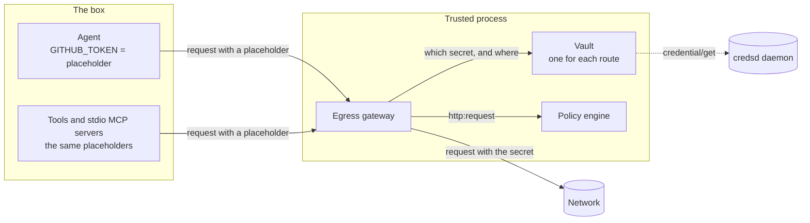
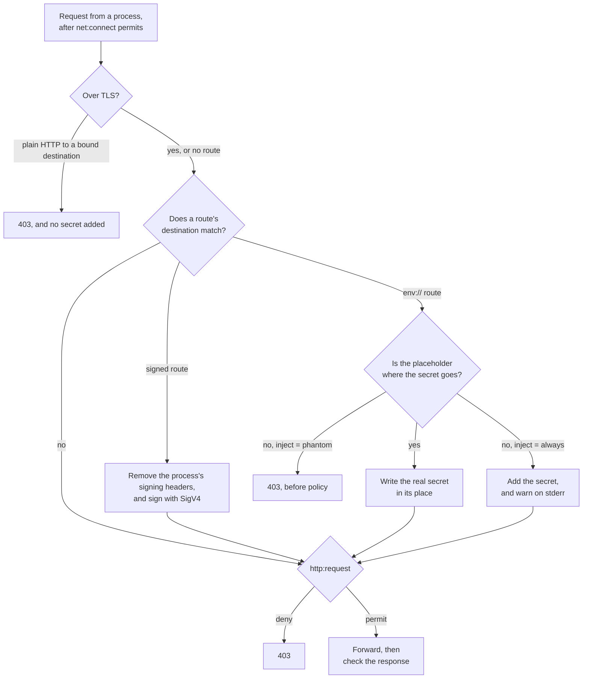
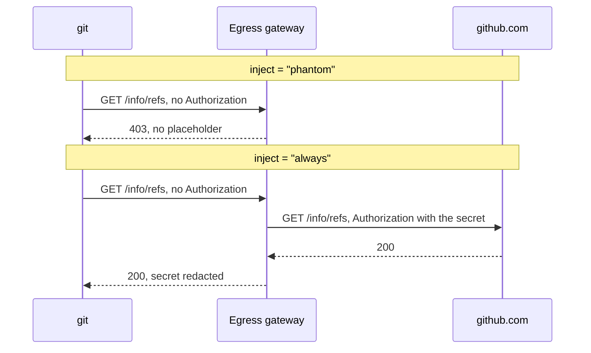

# How Box keeps credentials out of the box

An agent needs credentials to do useful work: a model key, a GitHub token, an AWS identity. Box
assumes the workload is hostile, so it never gives a real credential to any process inside a box.
The box's trusted process keeps each secret. The egress gateway adds it to a request on the way out, and
only to a request that goes to a destination the operator bound the secret to.

| A process in the box holds | The box's trusted process holds |
|---|---|
| A placeholder for each `env://` secret, or placeholder AWS keys for a signed route | The real secret, or the means to sign with it |
| The proxy variables and the box's certificate authority | The vault, the egress gateway, and the policy engine |

**A credential is not an authorization.** An `[egress.<name>]` route says which secret rides on a
request to its destinations. It permits nothing. Policy decides each connection and each request,
and a route adds its secret only to a request that policy permits
([a credential binding is configuration, not a policy action](./decisions.md#a-credential-binding-is-configuration-not-a-policy-action)).

**The box is the credential boundary.** Every process in a box gets every route. The gateway can't
tell which process sent a request, so it can't keep a credential from one process and give it to
another ([the box is the credential boundary](./decisions.md#the-box-is-the-credential-boundary)).
A process that must not use a credential belongs in a separate box.

[How Box controls outbound traffic](./egress.md) covers how a request reaches the gateway and how
policy decides it. This page covers what happens to the credential.

## Routes and their sources

A route names its destinations and one secret. `secret.ref` selects where the secret comes from.
The scheme decides everything else about the route.

| | `env://NAME` | `aws://PROFILE` | `credsd://NAME` |
|---|---|---|---|
| The secret comes from | The variable `NAME` in the environment of `box run` | The static access keys of the AWS profile `PROFILE` | The credsd daemon, for its environment `NAME` |
| Box reads it | Once, at startup | On each request | On each request |
| A process in the box gets | A placeholder in `NAME` | Placeholder `AWS_ACCESS_KEY_ID` and `AWS_SECRET_ACCESS_KEY` | The same placeholder AWS keys |
| The gateway | Swaps the placeholder for the secret | Signs the request with SigV4 | Signs the request with SigV4 |
| Where the secret goes | A header, HTTP basic auth, or a query parameter | The SigV4 headers | The SigV4 headers |
| The response | Every copy of the secret is redacted | Not scanned | Not scanned |
| The usual failure | A request without the placeholder gets a 403 | The host names no AWS service and region | The daemon is down, or has no session |

An http MCP server, `[mcp.<name>] type = "http"`, takes the same `secret` keys. Its credential uses
the same route, and everything on this page applies to it
([the `[mcp.<name>]` table](../user/mcp.md)).

Box accepts only these three schemes. A route that names any other scheme is refused when the
configuration loads
([a credential the box can't deliver is refused at load](./decisions.md#an-undeliverable-credential-is-refused-at-load)).

## The parts



| Part | What it does | What it holds |
|---|---|---|
| Vault | Reads each secret, mints each placeholder, finds the route for a request, and writes or signs the secret | The real secrets, in memory, wiped when the box stops |
| Egress gateway | Asks the vault for each request to a bound destination, applies what the vault returns, and scrubs the response | Nothing of its own |
| Policy engine | Decides `net:connect` and `http:request` | No credential |
| credsd | Vends short-lived AWS session credentials on request | Its own sessions. It runs outside Box, and Box never starts it. |

A secret value can't be empty, blank, or hold a control character. The vault refuses such a value
when it reads it, so no source can deliver one
([an unusable secret value is unrepresentable](./decisions.md#an-unusable-secret-value-is-unrepresentable)).

## At startup

Box prepares every route before the workload starts. A problem stops `box run` with an error that
names the route.

1. **The configuration loads.** Box refuses a route with no destinations, a destination that
   matches every host, an unknown scheme, or a key the scheme doesn't take. Two routes that match
   the same destination are refused too, so one request never has two candidate secrets.
2. **Box checks each `env://` variable.** The variable must be set and hold more than whitespace,
   and its name must not be one Box sets itself, such as `HTTPS_PROXY`.
3. **Box checks credsd.** If any route names `credsd://`, Box sends the daemon one health call and
   one list call for each environment. It refuses to start if the daemon doesn't answer, speaks
   another protocol version, or doesn't know an environment
   ([`box run` validates a credsd setup](./decisions.md#box-run-validates-a-credsd-setup-before-the-workload-starts)).
   A box with no `credsd://` route doesn't contact the daemon.
4. **The vaults open.** Box opens one vault for each route. An `env://` vault reads the variable
   and mints a placeholder. A signed vault reads nothing yet.
5. **Every process gets the placeholders.** The agent, each tool, and each stdio MCP server get
   every placeholder in their environments.

**A placeholder is random.** It is the route's `phantom_prefix`, or `strands_box_`, then 64 random
hex characters. `box.toml` calls it a phantom. The workload can read it, and so learn that a
credential exists, but the value authenticates nothing anywhere.

**A named AWS profile is the only identity.** An `aws://` route never falls back to the ambient
`AWS_*` variables, and it refuses a profile that uses `credential_process`, because that would make
the box's trusted process run a program a configuration file names
([a provider refuses an identity it can't honour](./decisions.md#a-provider-refuses-an-identity-it-cannot-honour)).

## On each request



1. **TLS only.** The gateway adds a secret only to a request inside a `CONNECT` tunnel. It refuses
   a plain `http://` request to a bound destination before it adds anything
   ([a secret rides only TLS](./decisions.md#a-secret-rides-only-tls)).
2. **Destination match.** The gateway gives the request to each route whose destination matches
   it. A request that matches no route goes on with nothing added.
3. **The route acts.** An `env://` route swaps the placeholder. A signed route signs. Either way,
   the gateway also sets `Accept-Encoding: identity`, so the response arrives uncompressed.
4. **Policy decides.** `http:request` sees the request as the process sent it, not the secret.
   The request goes out only if policy permits it.
5. **The response.** The gateway refuses a compressed response to a credentialed request, because
   it can't scan one. For an `env://` route, it replaces each copy of the real secret in the
   headers and the body with `[REDACTED]`.

A refusal is an HTTP 403 with the header `x-strands-box-egress: refused`, and a body that says why
([the error table](../user/egress.md#errors-and-exit-codes)).

## `env://`: the placeholder swap

The process sends the placeholder where it would send the real secret. The gateway finds it, clears
that location, and writes the real secret there. The placeholder never goes upstream beside the
secret ([the workload holds a phantom](./decisions.md#the-workload-holds-a-phantom-and-the-gateway-holds-the-secret)).

`secret.placement` says where the secret goes, and the gateway looks for the placeholder in the
same place ([the operator selects the placement](./decisions.md#the-operator-selects-the-credential-placement)):

| `placement` | The process sends | The gateway sends |
|---|---|---|
| `header` | `<header>: <prefix><placeholder>` | `<header>: <prefix><secret>` |
| `basic_auth` | `Authorization: Basic` with the placeholder as the password, under any user name | `Authorization: Basic` of the secret, which is a whole `user:password` pair |
| `query_param` | `<param>=<placeholder>` | `<param>=<secret>` |

**A placeholder sent elsewhere is forwarded as it is.** A request to a destination with no route
goes out unchanged. The placeholder is random, so the server that gets it learns nothing.

**Set `phantom_prefix` for a client that checks the key's format.** A client that refuses any key
that doesn't start with, for example, `sk-ant-` accepts a placeholder with that prefix. The cost is
that a reader of a log can no longer see that the value is a placeholder
([a route may set the phantom's prefix](./decisions.md#a-route-may-set-the-minted-phantoms-prefix)).

### When the client sends no placeholder

`secret.inject` decides what the gateway does with a request to a bound destination that doesn't
carry the placeholder ([a route may attach its secret always](./decisions.md#a-route-may-set-the-phantom-check-to-advisory)).

| `inject` | No placeholder, or a different value | What it proves |
|---|---|---|
| `phantom`, the default | 403, before policy decides the request | The request carries the value Box gave the box |
| `always` | The gateway adds the secret anyway, and warns on stderr for each request | Nothing about the sender |

**A lazy-auth client fails under `phantom`.** Some clients send their first request with no
credential, wait for a `401` challenge, and only then send the credential. `git` over HTTPS works
this way. Under `phantom`, the gateway answers that first request with a 403, so the client never
sees the `401` and never sends the placeholder.



There are two fixes:

- **Send the placeholder up front.** Configure the client to send its credential on the first
  request. For `git`, that is `http.extraHeader`. The route keeps the `phantom` check.
- **Set `inject = "always"`.** The client works unchanged. The cost: the gateway adds the secret
  to every request to the destinations, from any process, with or without the placeholder.

An `always` route is no weaker inside the box than a `phantom` route, because every process holds
every placeholder anyway. What `always` gives up is the proof that the request came through the
box's own binding, and the only trace of that is a warning on stderr and an allow record.

## Signed routes: `aws://` and `credsd://`

A signed route never puts a placeholder in a header. The gateway removes each signing header the
process sent, `Authorization`, `X-Amz-Date`, `X-Amz-Security-Token`, `X-Amz-Content-Sha256`, and
`X-Amz-Signature`, and signs the request again with SigV4. It reads the service and the region
from the host, which must end in `.amazonaws.com` or `.api.aws`, and refuses a host it can't read.

The process gets placeholder AWS keys so that an AWS SDK builds and signs its own request. The
gateway replaces that signature, so the placeholder keys never reach AWS.

**`aws://` signs with static keys.** The vault resolves the profile's access key and secret key
on each request.

**`credsd://` fetches credentials for each request.** The vault asks the daemon for the
environment's current session credentials, over a local socket, on every request. Box stores
nothing between requests, so the daemon owns the session and its renewal. A `credsd://` route never
falls back to the ambient AWS identity
([a `credsd://` entry names a daemon](./decisions.md#a-credsd-entry-names-a-daemon-and-the-daemon-names-the-type)).
The socket is `CREDSD_SOCKET`, or the platform default.

<a id="credentials-in-a-leaf-box"></a>

## Credentials for a tool or a local MCP server

A tool and a stdio MCP server get the same credential environment as the agent, each in its own
sandbox. Box composes each environment in this order, and a later entry replaces an earlier one with
the same name:

1. Every route's placeholder.
2. The `env` table of the tool or server.
3. The names Box sets itself: the proxy variables and the six certificate variables
   ([how traffic reaches the gateway](./egress.md#how-traffic-reaches-the-gateway)).

So a tool's `env` can replace a placeholder. A value an operator writes there is a real value in
the tool's sandbox, and Box doesn't protect it.

### Example: `git` over HTTPS

A `git` tool that fetches from GitHub needs three things: the proxy, trust in the gateway, and a
credential. Box gives the tool's sandbox `https_proxy` and `GIT_SSL_CAINFO`, so `git` sends its requests
to the gateway and accepts its certificate. The credential is a `basic_auth` route for
`github.com`, whose secret is the pair `x-access-token:<token>`.

`git` is a lazy-auth client, so the route needs one of the two fixes. With `phantom`, the agent
runs `git` with an extra header that holds the placeholder as the password:

```sh
git -c http.extraHeader="Authorization: Basic $(printf 'x:%s' "$GIT_GITHUB" | base64)" \
    ls-remote https://github.com/owner/repo.git
```

The gateway decodes the header, finds the placeholder in the password half, and sends the real pair
instead. With `always`, a plain `git ls-remote` works.

### Where the gateway adds nothing

| Case | Why |
|---|---|
| `git` over SSH, or any protocol other than HTTPS | The gateway carries only HTTP. A contained process can't open another connection. |
| A tool or MCP server with `contain_egress = false` | It connects directly, so its traffic never reaches the gateway ([native egress](./containment.md#local-mcp-servers)). A placeholder it holds authenticates nothing. |
| A client that ignores the proxy variables | The kernel lets a contained process connect only to the gateway, so the client can't connect at all. |

## The boundary

| Box guarantees | Box doesn't cover |
|---|---|
| No process in a box can read a real `env://`, `aws://`, or `credsd://` secret | A secret an operator writes into an `env` table |
| A secret goes only to its route's destinations | A credential file a filesystem grant exposes, such as `~/.aws/credentials` ([containment](./containment.md)) |
| A secret goes only over TLS | Keeping one route from one process in the box. Every process gets every route. |
| A copy of an `env://` secret in a response is redacted | A server that returns the secret in a form the scrub can't match, for example re-encoded |
| A request goes out only if policy permits it | What a permitted request does with the credential at the server |

## Failures

| Phase | What fails | What the operator sees |
|---|---|---|
| Configuration load | A bad route: no destinations, a match-all destination, two routes on one destination, an unknown scheme, a key the scheme doesn't take | `box run` exits before the workload starts, and the error names the route |
| Startup | An unset or blank `env://` variable, a reserved name, credsd not answering or missing an environment | `box run` exits before the workload starts |
| Each request | A plain `http://` request to a bound destination | 403, `credential not permitted on a plaintext request` |
| Each request | An `env://` request with no placeholder, or a different value, under `phantom` | 403, `blocked by egress control`, before policy |
| Each request | A signed request to a host with no readable service and region, an AWS profile that doesn't resolve, or credsd failing to vend | 403, `blocked by egress control` |
| Each request | Policy refuses `http:request` | 403 that names the rule |
| Response | A compressed response to a credentialed request | `response blocked by egress control` |

## Example: a coding agent with three credentials

An agent uses a model on Amazon Bedrock, calls the GitHub API, and runs `git` to fetch a
repository.

```toml
[egress.bedrock]
destinations = ["bedrock-runtime.us-west-2.amazonaws.com"]
secret.ref   = "aws://agent-model"

[egress.github_api]
destinations = ["api.github.com"]
secret.ref   = "env://GITHUB_TOKEN"

[egress.github_git]
destinations     = ["github.com"]
secret.ref       = "env://GIT_GITHUB"
secret.placement = "basic_auth"
secret.inject    = "always"

[tool.git]
command = ["git"]
```

`GITHUB_TOKEN` holds the token, and `GIT_GITHUB` holds `x-access-token:<token>`, in the host OS's
shell that runs `box run`.

```cedar
@id("bedrock")
permit (principal, action == Box::Action::"http:request", resource)
when { context.input.host == "bedrock-runtime.us-west-2.amazonaws.com" };

@id("github_api_read")
permit (principal, action == Box::Action::"http:request", resource)
when { context.input.host == "api.github.com" && context.input.method == "GET" };

@id("git_fetch")
permit (principal, action == Box::Action::"http:request", resource)
when { context.input.host == "github.com" };

@id("git_spawn")
permit (principal, action == Box::Action::"shell:spawn", resource)
when {
  context.input.program == "git" &&
  context.input has arg1 &&
  ["ls-remote", "fetch"].contains(context.input.arg1)
};
```

Each host also needs a `net:connect` permit on port 443, as in
[the `[egress.<name>]` table](../user/egress.md#example).

| Request | The process sends | The gateway | The result |
|---|---|---|---|
| The agent calls the model | A request signed with the placeholder AWS keys | Signs it again as `agent-model` | Permitted by `bedrock` |
| The agent reads an issue | `Authorization: Bearer <placeholder>` | Swaps in the token, redacts it from the reply | Permitted by `github_api_read` |
| The agent opens an issue | `POST`, with the placeholder | Swaps in the token | 403: no rule permits `POST` |
| The agent sends no `Authorization` to `api.github.com` | Nothing | Refuses: no placeholder, under `phantom` | 403, before policy |
| `git fetch` in the tool's sandbox | No `Authorization` on the first request | Adds the pair as basic auth, under `always` | Permitted by `git_fetch` |
| `curl` sends the placeholder to `example.com` | `Authorization: Bearer <placeholder>` | Adds nothing: no route | Decided by policy. The server gets a random value. |

`github_git` uses `always`, so any process in the box can reach `github.com` with the credential,
even with no placeholder. The agent could reach it too, through `curl`. `git_fetch` is the rule that
bounds what those requests can do.

## See also

- [The `[egress.<name>]` table](../user/egress.md): every route key, and every refusal.
- [How Box controls outbound traffic](./egress.md): routing, `net:connect`, and `http:request`.
- [How Box contains a process](./containment.md): the sandboxes for tools and local MCP servers,
  native egress, and filesystem grants.
- [Decisions: credentials](./decisions.md#credentials): why the design is the way it is.
