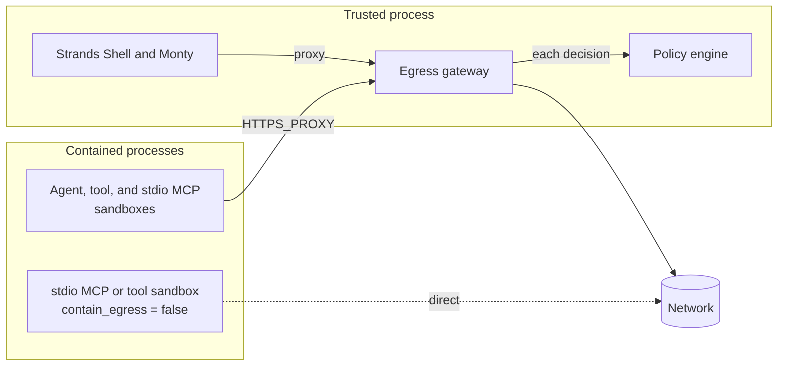
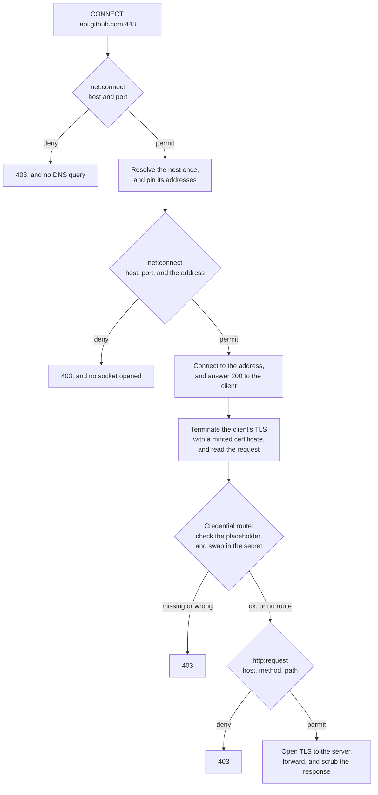
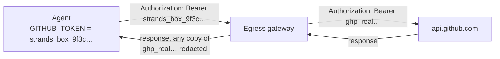

# How Box controls outbound traffic

Every box runs one egress gateway, in the box's trusted process and outside every box. Each network
request a contained process makes goes to the gateway, policy decides it there, and the gateway
forwards it. The gateway also adds the credentials the operator binds to a destination, so the real
secret never enters a box.

| The gateway | What it does |
|---|---|
| Decides | `net:connect` for each destination, before DNS and again for each address it dials. `http:request` for each request. `mcp:call` for each request to an http MCP server. |
| Adds | The secret an `[egress.<name>]` route binds to the destination. |
| Removes | A copy of that secret from the response, before the process sees it. |

[How Box runs MCP servers](./mcp.md) covers `mcp:call`.

## How traffic reaches the gateway

**Box points every process at the gateway.** The environment Box composes for the agent, each
tool, and each stdio MCP server sets the same proxy variables:

| Variable | Value |
|---|---|
| `HTTP_PROXY`, `HTTPS_PROXY`, `http_proxy`, `https_proxy` | `http://127.0.0.1:<gateway port>` |
| `NO_PROXY`, `no_proxy` | `127.0.0.1,localhost` |
| `NODE_USE_ENV_PROXY` | `1` |

`NODE_USE_ENV_PROXY` makes Node read the proxy variables. An operator can't set or override any of
these names: `box.toml` refuses each one in an `env` table.

**Box makes every process trust the gateway.** Each `box run` mints a new certificate authority,
in memory, and writes only its certificate to `<box_dir>/trust/cert.pem`. Six variables point each
common runtime at that file: `SSL_CERT_FILE`, `NODE_EXTRA_CA_CERTS`, `CODEX_CA_CERTIFICATE`,
`AWS_CA_BUNDLE`, `REQUESTS_CA_BUNDLE`, and `GIT_SSL_CAINFO`. The private key never leaves the
box's trusted process, and a run refuses to start if the certificate file holds private key material.

**The kernel holds every process to it.** A contained process can connect only to two local ports,
the gateway and the telemetry collector, so a client that ignores the proxy variables can't reach
the network at all ([macOS network restrictions](./macos-enforcement.md#network-connections-and-local-services)).
A stdio MCP server or a declared tool with `contain_egress = false` is the exception: it connects
directly, and the gateway never sees its traffic ([local MCP servers](./containment.md#local-mcp-servers)).

**Box's own interpreters use it too.** A `curl` in Strands Shell and a `fetch()` in Monty run in the
box's trusted process, and both send their requests through the same gateway, trusting only its
certificate authority. Before they do, each refuses a URL that isn't `http` or `https`, or that
names `localhost` or a literal loopback, private, or link-local address.

## How the gateway decides a request

A client sends either `CONNECT host:port` for HTTPS, or a plain HTTP request with an absolute
`http://` URL ([plain HTTP takes the same governed
path](decisions.md#plain-http-takes-the-same-governed-path-as-https)). Both pass the same
decisions.

### `net:connect`, before and after DNS

`net:connect` sees the host and the port, and after DNS, the address.

1. **Before DNS,** the gateway decides `net:connect` on the host and port. A deny ends the request
   there, so the gateway never looks up a refused host.
2. **The gateway resolves the host once** and pins the addresses it gets. It connects only to those
   addresses, so a DNS answer that changes later can't redirect the connection. An empty answer or
   a resolver error fails the request.
3. **Before it dials each pinned address,** in order, the gateway decides `net:connect` again, with
   the address. A deny stops the request. The first permitted address that answers is the one the
   gateway uses, and it decides no later address.

**An address is one spelling.** The gateway gives policy the address as a string, in one canonical
form: an IPv6 spelling of an IPv4 address, such as `::ffff:169.254.169.254`, becomes the IPv4
address, and other IPv6 addresses are compressed and lowercase. A rule matches it with `==` or
`like`.

**The host is one spelling too.** The gateway lowercases it and removes a trailing dot, so
`API.GitHub.com.` and `api.github.com` are the same host to a rule.

### TLS and `http:request`

**The gateway reads every HTTPS request.** Once a pinned address answers, the gateway acknowledges
the `CONNECT` and answers the client's TLS with a certificate for that host, signed by the box's own
certificate authority. Every `CONNECT` is intercepted, and the request inside must name the same
host as the `CONNECT`.

**`http:request` is decided for each request.** It sees the host, the port, the method, the path,
the body size, and whether the request came inside a `CONNECT`. The gateway puts the path in one
canonical form first: it decodes only the percent-escapes for unreserved characters, so `%2F` stays
encoded, removes `.` and `..` segments, and leaves out the query.

**The gateway opens TLS to the server last.** Only after `http:request` permits does it connect TLS
to the server, verify the server's certificate against a compiled-in set of public root
certificates, and forward the request. Each connection carries one request.

**A refusal is marked.** A request the gateway refuses gets a 403 with the header
`x-strands-box-egress: refused`, and a body that says why. A `net:connect` refusal of a `CONNECT`
arrives before the `200`, so the client never starts TLS. A policy refusal of a request to an http
MCP server gets a JSON-RPC error body.

### Cloud instance metadata

**Policy is the only check on metadata endpoints.** The gateway has no built-in block. A policy
needs two `forbid` rules on `net:connect`: one for the metadata hostnames
`metadata.google.internal` and `metadata.azure.internal`, and one for the metadata addresses
`169.254.*`, `fd00:ec2::254`, and the IPv6 link-local range.

## How credentials are added

[How Box keeps credentials out of the box](./credentials.md) covers each source, the request path,
and tools and local MCP servers in full. This section is the summary.

An `[egress.<name>]` route binds a secret to a set of destinations. It grants nothing: policy still
decides whether each request to those destinations goes out. The route decides only what rides on
a request that does.

> **Every process in a box can use every route.** The agent, each tool, and each stdio MCP server
> get every placeholder, and the gateway adds a route's credential by destination alone. The gateway can't tell which process opened a connection, so a per-process allowlist would
> bound nothing. A process that must not use a credential belongs in a separate box.
> [The box is the credential boundary](./decisions.md#the-box-is-the-credential-boundary) records the
> decision and its cost.

| Source | `secret.ref` | What the gateway does |
|---|---|---|
| An environment variable | `env://NAME` | Reads `NAME` from the environment of `box run` once, at startup, and swaps it in for a placeholder |
| An AWS profile | `aws://PROFILE` | Signs each request with SigV4, from the profile's static keys |
| credsd | `credsd://NAME` | Fetches material for the credsd environment `NAME` on each request, and signs with it |

### The placeholder swap

An `env://` route keeps the real secret in the box's trusted process and gives every contained process a
placeholder instead, which `box.toml` calls a phantom ([the workload holds a phantom, and the
gateway holds the secret](decisions.md#the-workload-holds-a-phantom-and-the-gateway-holds-the-secret)).

1. **At startup,** Box reads `NAME` from its own environment, keeps the value, and mints a
   placeholder: `strands_box_`, or the route's `phantom_prefix`, followed by 64 random hex
   characters. Each process gets the placeholder as `NAME`.
2. **The process sends the placeholder** where it would send the real secret, for example in its
   `Authorization` header.
3. **On a request to a bound destination,** the gateway looks for the placeholder where the secret
   goes. With `inject = "phantom"`, the default, a request without it, or with a different value,
   is refused with a 403, before policy decides the request. With `inject = "always"`, the gateway
   adds the secret anyway and warns on stderr.
4. **The gateway writes the real secret** in place of the placeholder. Policy still sees the
   request as the process sent it, and the request goes out only if `http:request` permits it.
5. **On the response,** the gateway replaces each copy of the real secret in the headers and the
   body with `[REDACTED]`. On a credentialed request, it asks the server for an uncompressed
   response and refuses a compressed one, so that every copy of the secret can be found.

**A placeholder sent anywhere else authenticates nothing.** The gateway forwards it unchanged to a
destination with no route. It's random, so the server that receives it learns nothing.

**The gateway adds a secret only over TLS.** It refuses a plain HTTP request to a bound destination
before it adds any credential ([a secret rides only TLS](decisions.md#a-secret-rides-only-tls)).

**`secret.placement` selects where the secret goes:** a header, HTTP basic auth, or a query
parameter ([placement keys](../user/egress.md#placement), [the operator selects the credential
placement](decisions.md#the-operator-selects-the-credential-placement)). The gateway looks for the
placeholder in the same place.

### Signed routes

An `aws://` or `credsd://` route signs each request rather than swapping a placeholder. The gateway
removes any signing headers the process sent, such as `Authorization` and `X-Amz-Date`, and signs
the request with SigV4. It reads the service and the region from the host, for example `bedrock`
and `us-west-2` from `bedrock-runtime.us-west-2.amazonaws.com`, and refuses a host it can't read
them from. The process gets placeholder `AWS_ACCESS_KEY_ID` and `AWS_SECRET_ACCESS_KEY` values, so
an AWS SDK builds its request, and the gateway replaces the signature.

## Example: a GitHub API request

Suppose `box.toml` has a route for `api.github.com` with `secret.ref = "env://GITHUB_TOKEN"`, and
`policy.dw` permits `net:connect` and `http:request` for that host. The agent runs `curl -H
"Authorization: Bearer $GITHUB_TOKEN" https://api.github.com/user`.

1. **Routing.** `curl` reads `HTTPS_PROXY` and sends `CONNECT api.github.com:443` to the gateway.
2. **Host.** `net:connect` permits `api.github.com:443`, before any DNS query.
3. **Address.** The gateway resolves the host once, `net:connect` permits the first address, and
   the gateway connects to it.
4. **Client TLS.** `curl` accepts the gateway's certificate for `api.github.com`, because
   `SSL_CERT_FILE` points at the box's certificate authority.
5. **Placeholder.** The request carries the placeholder in `Authorization`, so the gateway swaps in
   the real token.
6. **Request.** `http:request` permits `GET /user` on `api.github.com`.
7. **Server TLS.** The gateway opens TLS to GitHub, verifies its certificate, and forwards the
   request.
8. **Response.** The gateway scrubs any copy of the token from GitHub's reply, and `curl` gets the
   rest.

If `net:connect` refuses the host at step 2, `curl` gets the 403 in reply to its `CONNECT`.

## See also

- [The `[egress.<name>]` table](../user/egress.md): every route key, and what the box refuses at
  load.
- [How Box keeps credentials out of the box](./credentials.md): the vault, the placeholder swap,
  signed routes, and credentials for a tool or a local MCP server.
- [How Box runs MCP servers](./mcp.md): the `mcp:call` decision for an http MCP server.
- [How Box contains a process](./containment.md): the two kinds of enforcement, and native
  egress.
- [Policy](./policy.md): how the engine decides each request.
