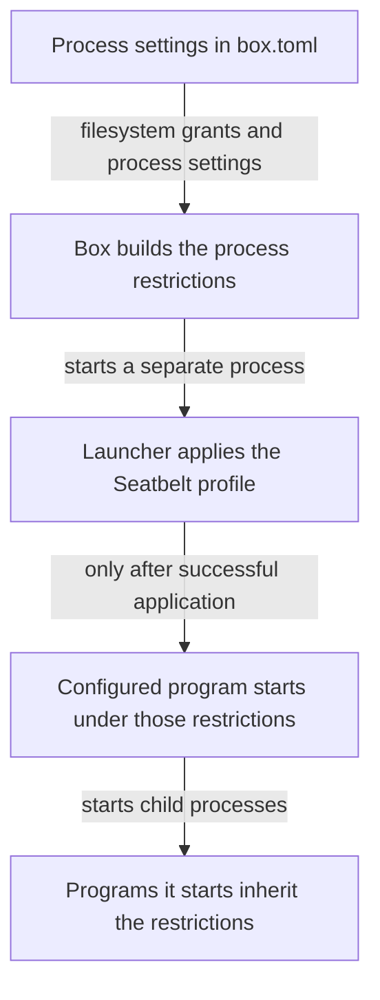

# How Box enforces sandbox restrictions on macOS

Box uses Seatbelt, macOS's process sandbox, to restrict the files, programs, and network connections an agent can access. Box sets those restrictions before the agent starts. This page explains how they work, why external tools receive different restrictions, and where the protection ends.

## See a sandbox restriction in action

Consider a project with two existing files: `allowed.txt` and `blocked.txt`. The first contains `Hello from the allowed file.` The operator (the person configuring Box) grants read access only to `allowed.txt` through `[agent.filesystem].read_file` in `box.toml`. A filesystem grant names a path and its permitted access. No other grant covers either file.

A small program stands in for the agent and asks macOS to read both files. Its output is:

```text
allowed.txt: Hello from the allowed file.
blocked.txt: read refused
```

The second file still exists. Seatbelt refuses the program's attempt to read it. The program prints `read refused`; that text is its own report, not a standard macOS error message.

Dogwood, Box's policy engine, does not check these individual file reads. The filesystem grant lets the program read the first file itself.

The agent can also ask Strands Shell, Box's built-in shell interpreter, to read a file on its behalf. Strands Shell checks policy before reading it. Seatbelt enforces the agent's own reads, and policy decides each read that Strands Shell makes for the agent. See [where policy sits](policy.md#where-policy-sits).

## What Seatbelt does

A Seatbelt **profile** is a set of rules that Seatbelt applies to a process. A rule identifies an operation, such as reading file contents, and the resources on which it is permitted.

Box generates a profile from the process's configuration and the system access it needs to run. The profile starts with a default refusal and adds rules for permitted operations. It also blocks changes to files Box protects, including its active policy files.

The program continues to make **system calls** (requests handled by the operating system's kernel). Seatbelt restricts resource access in that path. Box does not need to replace every file operation with a policy-engine request.

The restrictions [last for the process's lifetime](decisions.md#containment-ends-with-the-contained-process). Programs it starts [inherit the restrictions](decisions.md#children-inherit-the-boundary), including when a child replaces itself with another program. Starting a new shell does not give that shell unrestricted access.

## How Box applies the restrictions

Box reads the process settings in `box.toml` and combines them with the required system access. It determines the restrictions before the program starts and [keeps them unchanged for that run](decisions.md#containment-is-fixed-and-built-without-running-a-program).

Box then starts a small launcher, `strands-box-contain-trampoline`. This launcher [applies the restrictions before starting the configured program](decisions.md#one-trampoline-spawns-every-contained-process). On macOS, it applies the generated profile through `sandbox_init()`, the system function for applying a sandbox to the calling process.



If applying the restrictions fails, [Box refuses to start the program](decisions.md#every-failed-or-unsupported-apply-refuses-the-workload).

Strands Shell, Monty (Box's Python interpreter), and the egress gateway run in the box's trusted process, outside the agent's sandbox. The **egress gateway** checks and forwards outbound network requests. These components enforce policy on requests they handle. A policy permit for one of them does not expand the agent's own filesystem grants.

## What the sandbox permits

### Files and directories

File access has several separate parts. Knowing that a file exists, listing its directory, and reading its contents are different operations.

| Access | What it permits | Configuration example |
|---|---|---|
| Read one file | Read that file's contents and information about it. | `read_file` names the file. |
| Read a directory tree | Read files beneath that directory. | `read` names the directory. |
| Write files | Modify the named file or files beneath the named directory. On macOS, this does not also grant read access. | `write` names a directory or file. |
| List directories | Enumerate directory entries without granting file-content reads. | `list` names a directory tree. |
| Inspect file information | Query metadata, such as existence and attributes, without reading file contents. | The agent's `metadata` list names a directory tree. |

Setting `workspace` chooses the program's initial working directory. Setting `HOME` chooses its home directory. Neither setting grants access to the contents of that directory.

The process also needs system libraries and other runtime files. Box adds a [minimum set of system paths](decisions.md#the-runtime-minimum-is-two-sets-and-the-agent-takes-the-smaller-one) to the filesystem grants configured by the operator. The agent and external tools receive different sets, and [`os-paths.macos.json`](../../crates/containment/src/containment-data/os-paths.macos.json) lists both.

### Network connections and local services

For a process that uses the gateway, Box permits connections to specified local ports, including the gateway and telemetry receiver. The telemetry receiver collects application logs, metrics, and traces.

For gateway traffic, Seatbelt controls whether the process can connect to Box's local gateway port. Dogwood decides whether the gateway may connect to the destination and forward the request.

Box's **broker** receives the agent's requests and routes them to Strands Shell, Monty, or a configured Model Context Protocol (MCP) server. Box permits the agent to contact the broker through a local socket (a connection between processes on the same machine).

A local MCP server can have `[mcp.<name>.network].contain_egress = false`. This selects [native egress](decisions.md#native-egress-is-an-operator-declared-leaf-escape), which bypasses the gateway and its network policy checks. A declared tool can have the same `[tool.<name>.network].contain_egress = false`. The agent's declaration refuses it.

<a id="how-a-leaf-boxs-profile-differs"></a>
### How the profile for a tool or local MCP server differs

The sandbox for a tool or a local MCP server is wider than the agent's sandbox. [A tool's
sandbox](containment.md#a-tools-leaf-box) explains why, and what the two sandboxes share. On macOS,
each difference is one change to that sandbox's Seatbelt profile:

| Difference | What that profile adds |
|---|---|
| Runs any helper program | `(allow process-exec*)`, where the agent's profile has one `process-exec` literal per `exec` entry. |
| Loads what it builds | An `(allow file-map-executable ...)` over that sandbox's own writable grants, after the write cell's deny. |
| Sees what exists across the home | `(allow file-test-existence ...)` and `(allow file-read-metadata ...)` over the operator home, then denies of both over the box directory and the credential stores. |
| Reads startup network settings | `(allow sysctl-read (sysctl-name-prefix "net."))` and `(allow system-socket (socket-domain AF_ROUTE))`. |

Both profiles carry
`(allow mach-lookup (global-name "com.apple.system.opendirectoryd.libinfo"))`, the account lookup a workload can need at startup.
[`crates/containment/README.md`](../../crates/containment/README.md#macos-profile) lists every rule
the profile grants.

## Limits and necessary exceptions

**The profile has to support the program.** A program may need libraries or local services that its sandbox does not permit. A new program or macOS version can change those needs.

### File timestamps may not be preserved

In tested macOS configurations, tools could write file contents but could not restore file timestamps. This affected timestamp-preserving copies, archive extraction, synchronization, and source-package installation.

**An operation can report success with incorrect timestamps.** It can also fail after writing some output. Check both file contents and timestamps when preservation matters.

These results were observed on macOS 27.0.1 with Box revision `08bc940b`. A broader write rule restored timestamps but also permitted forbidden changes to file group ownership. It is not a safe workaround. See the [timestamp compatibility investigation](https://github.com/strands-agents/box/issues/89) for follow-up.

### What the sandbox does not provide

Allowed writes change real files, and the sandbox does not undo them when the program exits. Process restrictions also do not set resource budgets or make an allowed script safe.

[Limits of Box's protection](limitations.md) explains these risks, the components Box relies on, and the protections that require controls outside Box.

## Understanding a refused operation

Start with the operation that failed and the process that performed it. The same filename can appear in a native agent read, a Strands Shell request, or an external tool's operation.

| Symptom | What to check |
|---|---|
| The program never starts | Read Box's startup error. Distinguish profile application from a failure to launch the configured program. |
| A native file read fails | Check the reading process's filesystem grants and the file's actual path. A policy permit for Strands Shell does not grant a native read. |
| A file is visible but cannot be read | Check whether the process has metadata or directory-listing access without content-read access. |
| An external tool cannot use a file | Check that tool's configuration. Its access can differ from the agent's. |
| A network request fails | Check whether the sandbox permits the connection. For gateway traffic, check the client's proxy configuration and the gateway's policy decision. |

An application error by itself does not identify which check refused the operation. Preserve the error and Box's startup output before changing grants. [If something goes wrong](../user/getting-started.md#if-something-goes-wrong) explains how to keep the errors.

Box reports agent and declared-tool grants at startup, including added system paths. It does not include local MCP server grants in that report; inspect the server's configuration separately.

## Reading a profile rule

Seatbelt profiles use **Sandbox Profile Language (SBPL)**, a Scheme-like language. Operators configure Box through `box.toml`; Box generates the profile.

This illustrative excerpt permits reads of one named file:

```scheme
(version 1)
(deny default)
(allow file-read* (literal "/Users/example/project/allowed.txt"))
```

`literal` matches that exact path. `file-read*` covers file-read operations, including contents and metadata. A directory-tree rule uses `subpath` to match a path and its descendants.

This is not a complete Box profile. A running program also needs execution rules, runtime access, and the other restrictions described above. The excerpt explains the rule's shape; it is not a configuration to install.

For Box's request-level checks, read [Policy](policy.md). For installation and agent configuration, read [Getting started](../user/getting-started.md).
