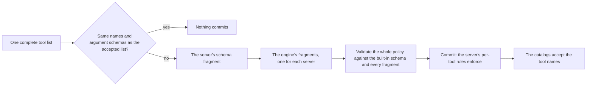
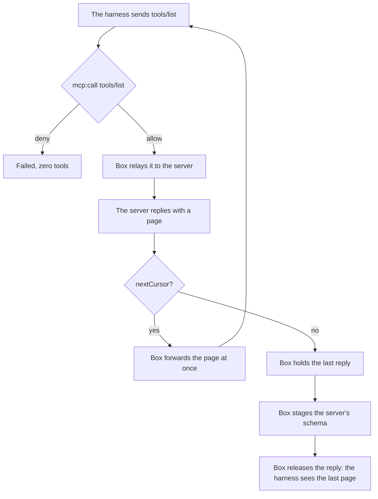
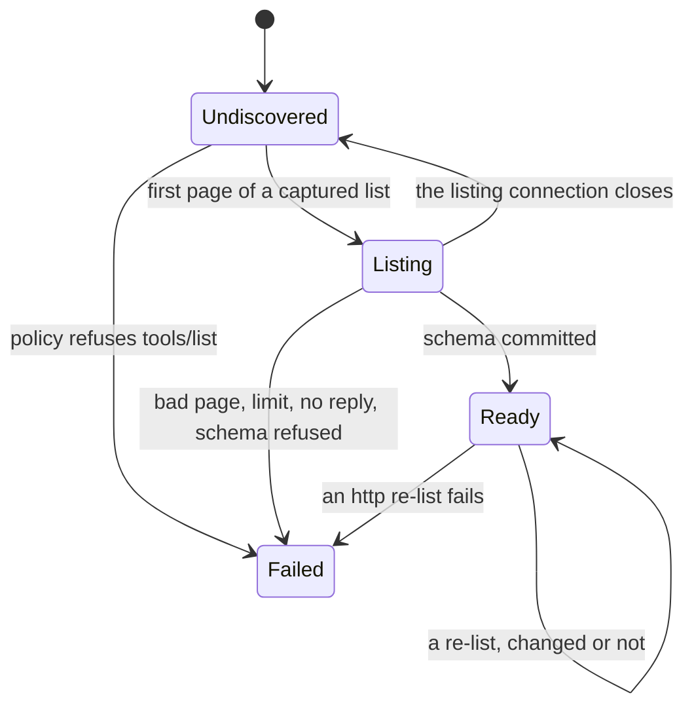

# How Box discovers MCP tools

An operator often wants more than "allow this MCP server". They want to allow a tool and still
refuse some of the ways it can be called, for example a GitHub search that returns at most five
results. Box's policy language, Dogwood, can express that because it extends Cedar, and Cedar checks
each rule against a schema before it loads the rule. The schema says which actions exist and what
each action's input looks like. A rule that names an action the schema doesn't declare, or compares
an argument as a number when the schema doesn't type it as one, doesn't load ([the policy language
is Dogwood](decisions.md#the-engine-is-dogwood)).

The schema has two parts, and policy loads in two steps to match:

| | The built-in schema | The generated schema |
|---|---|---|
| What it declares | Box's own actions: `net:connect`, `http:request`, `shell:spawn`, `fs:*`, and `mcp:call` with the server, method, tool, prompt, and URI | One action for each tool on each server, such as `github::Action::"search_repositories"`, with a typed field for each argument |
| Where it comes from | Box ships it | Box builds it from each server's answer to `tools/list` |
| When it's available | When the box starts | When that server's tool list arrives |
| Rules it enables | A server permit, a method or tool-name `forbid` on `mcp:call`, and every egress, shell, and file rule | A rule that names a tool's own action, such as `github::Action::"get_me"`, or tests its arguments, such as `context.input.perPage > 5` |

When the box starts, the policy engine commits every rule that validates against the built-in
schema, so the agent, the shell, the egress gateway, and every server's `mcp:call` permit work at
once. A rule that names a tool's own action waits until that server's part of the generated schema
is staged. Then a rule like this one loads and enforces:

```cedar
forbid (principal, action == github::Action::"search_repositories", resource)
when { context.input has perPage && context.input.perPage > 5 };
```

Building the generated schema is discovery. It works the same way for both kinds of MCP server: a
stdio server that Box starts, and an http server that Box reaches through the egress gateway. Box
reads the replies to the harness's own `tools/list`, and sends no list of its own. It holds the
reply to the last page until that server's schema commits, so a tool is never callable before its
rules enforce ([Box discovers an MCP tool schema from the live server's own
list](decisions.md#mcp-tool-schemas-are-discovered-from-the-live-server)).

The rest of this page starts with how a tool list becomes enforced rules, then shows the flow for
each kind of server, names the parts and the states they move through, and ends with how discovery
finishes, what happens when a server lists again, and the limits. For the policy levels and how Box
decides a tool call, start with [How Box runs MCP servers](./mcp.md).

## How a tool list becomes enforced rules

Staging is the step that turns one server's complete tool list into enforced rules. Box generates
the server's schema fragment, one policy action for each tool with typed arguments ([per-tool
actions and their arguments](./mcp.md#per-tool-actions-and-their-arguments)), and the policy engine
commits it.



The policy engine keeps one fragment for each server. Each commit rebuilds the combined schema from
all of them, validates the whole policy against it, and commits the result, so the last commit holds
every server's schema. Commits happen one at a time, and each server commits as soon as its own list
is complete:

| Commit | When | What it adds | Engine readiness |
|---|---|---|---|
| 1 | The box starts | Every rule that validates against the built-in schema. Per-tool rules wait. | `Discovering` while a per-tool rule waits, otherwise `Ready` |
| One for each server | That server's list completes | That server's fragment, and the per-tool rules that now validate | `Ready` once every per-tool rule validates |

A server with no per-tool rule still commits, so its tools join the schema. A server that fails, is
refused, or never connects adds no commit.

While the engine is `Discovering`, the committed rules decide each request ([discovery serves the
schema-independent subset](decisions.md#discovery-serves-the-schema-independent-subset)). A tool
call whose per-tool rule still waits is refused as pending. A call to a tool of a degraded server,
one whose per-tool rule can never load, is refused.

## How a server is discovered

The two kinds of server take the same steps. The main path is below, and the last column of each
step table is the server's discovery state ([the parts and their
states](#the-parts-and-their-states)).




Box captures a list that starts with no cursor and follows its own `nextCursor` chain, and builds
the server's tool list from it ([pages, limits, and failures](#pages-limits-and-failures)).

The two kinds of server differ in how they hold the last reply. A stdio connection carries many
frames, so the broker keeps the reply in the connection's queue, stages on a background thread, and
keeps relaying other frames while it waits. An http request has its own thread, so the gateway
stages on that thread before it writes the response.

### A stdio server

| Step | What happens | Server state |
|---|---|---|
| 1 | The harness runs the server's alias. `shell:spawn` decides the declared program, and Box starts the server in its own sandbox. | `Undiscovered` |
| 2 | The harness sends `initialize`. It crosses with no decision, and the broker checks the protocol version in the reply. | `Undiscovered` |
| 3 | The harness sends `tools/list`, and `mcp:call` decides it. A refused list never reaches the server. | `Failed` if refused |
| 4 | The broker relays the request. Box captures a list that names no cursor, and gives it 30 seconds for each reply. | `Undiscovered` |
| 5 | A page with a `nextCursor` is merged and forwarded at once. | `Listing` |
| 6 | The last page completes the list. The broker holds its reply and starts staging. | `Listing` |
| 7 | The schema commits, and the server's per-tool rules enforce. | `Ready` |
| 8 | The broker sends the held reply, and the harness sees the last page. | `Ready` |
| 9 | Once every stdio server is `Ready` or `Failed`, and every held reply is written, the broker reports the stdio side done. | |

A failure at steps 5 to 7 sends the harness an MCP error that names the failed step, in place of the
reply. A failed stdio server takes no new connections for the rest of the run, and its other
connections close.

### An http server

| Step | What happens | Server state |
|---|---|---|
| 1 | The harness connects through the egress gateway. `net:connect` decides the host before DNS and each address after it. | `Undiscovered` |
| 2 | Each request is decided as `http:request`, and its MCP frame as `mcp:call`. `initialize` is decided on an http server. | `Undiscovered` |
| 3 | `mcp:call` decides `tools/list`. A refusal is a 403. | `Failed` if refused |
| 4 | The gateway forwards the request and reads the whole response. | `Undiscovered` |
| 5 | Before it writes the response, the gateway hands the page to the tool catalogs, with the request's `Mcp-Session-Id` and cursor. | `Listing` |
| 6 | On the last page the catalogs stage the schema, on the request's thread. Once every http server is `Ready` or `Failed`, the gateway reports the http side done. | `Ready` |
| 7 | The gateway writes the response, and the harness sees the last page. | `Ready` |

The http side reports done before it writes the last response, so it doesn't wait for the harness to
have the tools, as the stdio side does. A failure withdraws the server's accepted tools, the
response still reaches the harness, and stderr names the failure. An http server that fails stays
reachable, and each call to its tools is refused.

## The parts and their states

Five parts take part in the steps above. All of them run in the box's trusted process.

| Part | What it does | State it holds |
|---|---|---|
| The tool catalogs | One set per box, shared by both kinds of server. They collect a server's pages, stage its schema, and check each `tools/call` against the accepted tool names. | Each server's discovery state and accepted tools, and each unfinished list |
| The MCP broker | Relays each stdio connection, holds the last page's reply, and reports when every stdio server is done. | Each connection's pending lists and held replies; whether the stdio side is done |
| The egress gateway and its policy hook | Relays each http request, hands each `tools/list` reply to the catalogs, and reports when every http server is done. | None of its own |
| The policy engine | Validates the policy against the combined schema, and commits it. | Its readiness: `Discovering` or `Ready` |
| The discovery coordinator | Waits for both kinds of server to report, then finishes discovery once ([the box coordinates discovery completion](decisions.md#the-box-coordinates-discovery-completion)). | The sides still to report |

### A server's discovery state

Each declared server is in one of four states.



- **`Undiscovered`**: no list has arrived.
- **`Listing`**: a list is arriving, and no catalog is accepted yet.
- **`Ready`**: a catalog is accepted, and its tools are callable.
- **`Failed`**: discovery failed, and the reason names the step that failed.

`Ready` and `Failed` are terminal for startup: a server in either state counts as done.

These states are how Box tracks discovery. [When startup is
complete](./mcp.md#when-startup-is-complete) describes the outcome the operator sees: a `Ready`
server is Ready there, and a `Failed` server is No tools or Degraded when policy refused its
`tools/list`, and Failed for any other reason ([a server whose discovery a policy denies degrades
alone](decisions.md#a-server-whose-discovery-a-policy-denies-degrades-alone)).

## How discovery finishes

Each side reports to the coordinator once: the broker for the stdio servers, and the gateway for the
http servers. The gateway reports only when `box.toml` declares an http server. When the last side
reports, the coordinator finishes discovery once. A per-tool rule that still hasn't validated
belongs to a server that will never stage, so that server is degraded, stderr names it, and the
engine becomes `Ready` for the rest of the run.

A declared server that never connects stays `Undiscovered`, so its side never reports and discovery
never finishes. The engine still becomes `Ready` if every per-tool rule validates, and stays
`Discovering` only while a rule waits for a server that hasn't staged. Either way, every other
server's rules are already committed, so no request waits on the missing server.

## When a server lists again

A harness can list a server again: on a reconnect, from a second window, or after the server sends
`notifications/tools/list_changed`. On a stdio server each connection is its own server process, and
its list reaches that process.

Box compares the new list's fingerprint with the accepted one. The fingerprint is each tool's name
and `inputSchema`, sorted by name, and the list's `$defs`. A description, a title, or tool order
doesn't change it.

| The new list | stdio server | http server |
|---|---|---|
| The same fingerprint | Nothing commits, and the reply goes out at once | Nothing commits |
| A different fingerprint | It commits, and replaces the accepted tools | It commits, and replaces the accepted tools |
| It fails | The accepted tools stay | The accepted tools are withdrawn |

During a change's commit, only the tools that both lists name pass the catalog check. A server can
change its tools 16 times in one run. After that, its accepted tools stay, and stderr names it.

## Pages, limits, and failures

Box captures a list only along its own cursor chain: the first request names no cursor, and each
later request names the `nextCursor` of the page before it, on the same connection. On an http
server, `Mcp-Session-Id` is the connection. A list that starts with a cursor, or a cursor that
doesn't continue the chain, still reaches the harness, but Box doesn't capture it. So the harness
can't shape what Box captures, and the pages always come from the server.

| Limit | Value | When a list goes over it |
|---|---|---|
| Pages in one list | 256 | The list fails |
| Bytes in one list | 8 MiB | The list fails |
| Discovery data in one run | 32 MiB, checked best-effort | The list that goes over it fails |
| Unfinished lists for one server | 4 | A new list replaces the oldest unfinished one |
| Catalog changes for one server | 16 in one run | The accepted tools stay |
| Time for a stdio server to answer a captured list | 30 seconds | The server fails |

A failure stays with its server:

| Failure | That server | The other servers |
|---|---|---|
| `shell:spawn` refuses a stdio server | It never starts | Unaffected |
| Policy refuses `tools/list` | `Failed` with zero tools, and each call to its tools is refused | Unaffected |
| A bad page, a limit, or no reply in time | `Failed` | Unaffected |
| The schema can't be generated, or policy refuses it | `Failed` | Unaffected |
| A re-list fails after `Ready` | stdio: keeps its tools. http: `Failed`, tools withdrawn | Unaffected |
| The policy history can't be written | stdio: the box stops. http: stderr warns, and the box keeps running | stdio: the box stops |

A harness that stops paging before the last page leaves the server unstaged, and each call to its
tools is refused.

## Example: Claude Code with five servers

The box runs Claude Code with two stdio servers and three http servers. The `docs` server is
declared, but nothing is running at its address. This is the MCP part of `box.toml`; the `[agent]`
table and the model's egress route are as in [getting started](../user/getting-started.md), and the
stdio servers' filesystem grants are left out ([the `[mcp.<name>]` table](../user/mcp.md)):

```toml
[mcp.fetch]
type    = "stdio"
command = ["mcp-server-fetch"]

[mcp.git]
type    = "stdio"
command = ["mcp-server-git"]

[mcp.github]
type         = "http"
destinations = ["api.githubcopilot.com"]
secret.ref   = "env://GITHUB_MCP_TOKEN"

[mcp.deepwiki]
type         = "http"
destinations = ["mcp.deepwiki.com"]

[mcp.docs]
type         = "http"
destinations = ["mcp.docs.example.com"]
```

The MCP rules in `policy.dw`:

```cedar
@id("mcp_starts")
permit (principal, action == Box::Action::"shell:spawn", resource)
when { ["mcp-server-fetch", "mcp-server-git"].contains(context.input.program) };

@id("mcp_hosts")
permit (principal, action == Box::Action::"net:connect", resource)
when { ["api.githubcopilot.com", "mcp.deepwiki.com", "mcp.docs.example.com"].contains(context.input.host) };

@id("mcp_requests")
permit (principal, action == Box::Action::"http:request", resource)
when { ["api.githubcopilot.com", "mcp.deepwiki.com", "mcp.docs.example.com"].contains(context.input.host) };

@id("mcp_servers")
permit (principal, action == Box::Action::"mcp:call", resource)
when { ["fetch", "git", "github", "deepwiki", "docs"].contains(context.input.server) };

@id("hide_deepwiki_tools")
forbid (principal, action == Box::Action::"mcp:call", resource)
when { context.input.server == "deepwiki" && context.input.method == "tools/list" };

@id("small_github_searches")
forbid (principal, action == github::Action::"search_repositories", resource)
when { context.input has perPage && context.input.perPage > 5 };

@id("short_fetches")
forbid (principal, action == fetch::Action::"fetch", resource)
when { context.input has max_length && context.input.max_length > 100000 };
```

The first five rules validate against the built-in schema, so they load when the box starts. The
last two name a tool's own action, so each one waits for its server's part of the generated schema.
`git` has no per-tool rule, and its schema still stages, so a rule for it could be added later.

When Claude Code starts and lists each server, the states move like this:

| Moment | Engine | fetch | git | github | deepwiki | docs | Waiting to report |
|---|---|---|---|---|---|---|---|
| The box starts, commit 1 | `Discovering` | `Undiscovered` | `Undiscovered` | `Undiscovered` | `Undiscovered` | `Undiscovered` | stdio, http |
| `hide_deepwiki_tools` refuses deepwiki's `tools/list` | | | | | `Failed` | | |
| Each list's last page arrives, and each reply is held | | `Listing` | `Listing` | `Listing` | | | |
| github commits: `small_github_searches` enforces | | | | `Ready` | | | |
| fetch commits: `short_fetches` enforces, and fetch's reply goes out | `Ready` | `Ready` | | | | | |
| git commits, and its reply goes out | | | `Ready` | | | | http |
| `docs` never answers | | | | | | `Undiscovered` | http |

The commits run one after another, so the later servers wait behind the first. The engine becomes
`Ready` when fetch commits, because both per-tool rules then validate. The stdio side reports done
when git's reply goes out. Discovery itself never finishes, because `docs` keeps the http side from
reporting, but no request waits on it.

When Claude Code reconnects `fetch`, a new server process answers a new `tools/list`. Its
fingerprint matches, so nothing commits, and the tools are back at once.

## See also

- [How Box runs MCP servers](./mcp.md): the policy levels, how a server starts, and how Box decides
  a tool call.
- [Policy](./policy.md): how the engine decides each request, and what refuses to load.
- [Write policy for an MCP server](../user/mcp-policy.md): the permits and per-tool rules an operator
  writes.
- [Decisions](./decisions.md): why discovery is passive, and why the box coordinates it.
