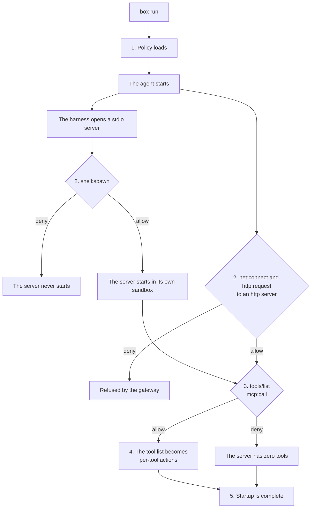
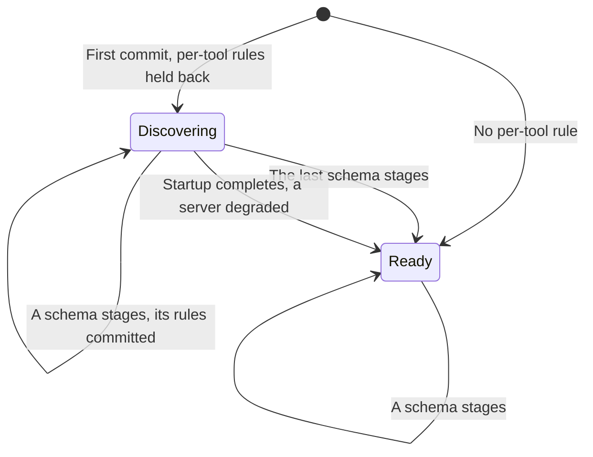
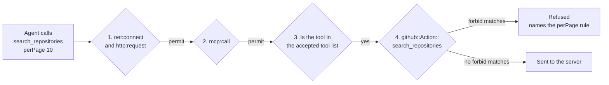

# How Box runs MCP servers

Box supports two types of MCP server. A **stdio server** is a program Box starts on the operator's
machine, and an **http server** runs somewhere else. Either way, the agent reaches the server only
through Box, and policy decides each request it makes.

This page follows a server from `box run` to its first tool call. It starts with what a rule can
control, then shows how a server starts and how Box learns its tools, and ends with how Box decides
each tool call.

| | stdio server | http server |
|---|---|---|
| Declared as | `[mcp.<name>]` with `type = "stdio"` | `[mcp.<name>]` with `type = "http"` |
| Runs in | Its own sandbox, which Box starts | Somewhere else. Box checks its requests, not the server. |
| Reached through | The server's alias, then the MCP broker, then the server's stdin | The egress gateway |
| Starting or connecting | `shell:spawn` | `net:connect` and `http:request` |
| Each MCP request | `mcp:call` | `mcp:call` |

Box starts each stdio server in a sandbox of its own, separate from the agent's
([local MCP servers](./containment.md#local-mcp-servers)). The MCP broker is the part of Box that
receives the agent's requests over a local socket, and the egress gateway checks and forwards every
outbound network request.

**Two permissions cover a server.** A server needs `shell:spawn`, or `net:connect` and
`http:request`, plus `mcp:call`. Together they allow every tool on the server ([an MCP tool call
takes two decisions](decisions.md#mcp-authorization-is-two-gates)). Every other MCP rule narrows
that.

**The server's name comes from `box.toml`.** A rule reads the `[mcp.<name>]` table's name, never a
value from the request ([every MCP server is one configuration
table](decisions.md#an-mcp-server-is-one-configuration-table)).

## Policy levels

Two actions decide MCP requests, and a rule can narrow either one.

| Level | Action | What the rule reads | Example rule |
|---|---|---|---|
| Server | `Box::Action::"mcp:call"` | `context.input.server` | `forbid (principal, action == Box::Action::"mcp:call", resource) when { context.input.server == "deepwiki" };` |
| Method | `Box::Action::"mcp:call"` | `context.input.method` | `forbid (principal, action == Box::Action::"mcp:call", resource) when { context.input.server == "deepwiki" && context.input.method == "tools/list" };` |
| Tool, prompt, or resource | `Box::Action::"mcp:call"` | `context.input.tool`, `.prompt`, or `.uri` | `forbid (principal, action == Box::Action::"mcp:call", resource) when { context.input has tool && context.input.tool == "get_me" };` |
| Tool | `github::Action::"get_me"`, one per tool | The action itself | `forbid (principal, action == github::Action::"get_me", resource);` |
| Tool arguments | `github::Action::"search_repositories"`, one per tool | `context.input.<argument>` | `forbid (principal, action == github::Action::"search_repositories", resource) when { context.input has perPage && context.input.perPage > 5 };` |
| History | Either action, in a `when temporal` clause | Earlier `::request` or `::response` events | `forbid (principal, action == Box::Action::"mcp:call", resource) when { context.input.server == "github" && context.input.method == "tools/call" } when temporal { … };` |

**`mcp:call` is built in.** It's decided on every MCP request, so one rule can combine the server,
the method, and the item. `tool`, `prompt`, and `uri` are present only on the method that carries
them, so a rule tests them with `has` first.

**A per-tool action is generated** for each tool a server lists. It's decided only for a
`tools/call`, after `mcp:call` allows the call. A rule on it can refuse the whole tool, or only the
calls whose arguments match a condition.

**A history rule** adds a `when temporal` clause to a rule at any level, for example to cap how
often the agent calls a server ([what a history rule sees](./policy.md#what-a-history-rule-sees)).

**Each level narrows with a `forbid`.** A server's `mcp:call` permit already allows every method
and every tool. A `permit` on a per-tool action changes no verdict, though the decision log then
names it as the deciding rule.

The `mcp:call` levels work as soon as the box starts. The per-tool levels can't:
`github::Action::"search_repositories"` and its typed `perPage` exist only once Box has learned the
server's tools, and that happens while the server starts.

## How a server starts

Box builds a server's per-tool actions while the server starts, from the server's own
`tools/list`. Startup is five steps, and step 4 is where the actions are made. The agent starts at
once, and each server becomes callable on its own schedule.



1. **Policy loads,** in one commit, or in stages when it has a per-tool rule. See [staged policy
   commits](#staged-policy-commits).
2. **The server starts, or the agent connects to it.** See [starting the
   server](#starting-the-server).
3. **The harness lists the tools,** as an `mcp:call` request. See [starting the
   server](#starting-the-server).
4. **The tool list becomes per-tool actions.** See [per-tool actions and their
   arguments](#per-tool-actions-and-their-arguments).
5. **Startup is complete** when every server has reported. See [when startup is
   complete](#when-startup-is-complete).

### Starting the server

**A stdio server starts on demand.** It starts when the agent's harness opens the server's alias in
the box's `bin/`, not when `box run` starts. The broker decides `shell:spawn` on the program and
arguments from `box.toml`, before the process exists. If it's allowed, the server starts in its own
sandbox.

**An http server is already running.** The gateway decides `net:connect` before DNS, again for
each resolved address, and `http:request` for each request. Each MCP request to the server is one
of those HTTP requests.

**The harness lists the tools.** `tools/list` is an `mcp:call` request, so a server's `mcp:call`
permit also lets the agent list its tools, and a rule can refuse it to hide a server's tools. A few
protocol methods a connection needs cross with no decision ([the protocol floor is
narrow](decisions.md#four-mcp-methods-are-never-gated)).

### Per-tool actions and their arguments

Each tool a server lists becomes its own action, such as `github::Action::"search_repositories"`.
Take the rule from the tool arguments row:

```cedar
forbid (principal, action == github::Action::"search_repositories", resource)
when { context.input has perPage && context.input.perPage > 5 };
```

To load, this rule needs an action named `github::Action::"search_repositories"` and a typed
`perPage` under that action's `context.input`. Neither is built in. Both come from the server.

**The server describes its tools.** Each tool in a `tools/list` reply carries its name and an
`inputSchema`, the JSON Schema of its arguments. Box reads the replies to the harness's own
`tools/list`, through the broker for a stdio server and through the gateway for an http server, and
sends no request of its own. It follows the harness's pages from the first, and holds the reply to
the last page until the schema stages ([Box discovers an MCP tool schema from the live server's own
list](decisions.md#mcp-tool-schemas-are-discovered-from-the-live-server)).

**Box turns the reply into a schema,** for every server, whether or not a rule names its tools:

```text
tools/list reply                                  generated schema (abridged)
-------------------------------------------       ---------------------------------------------
{ "name": "search_repositories",                  action "search_repositories" appliesTo {
  "inputSchema": {                                  context: { input: {
    "properties": {                                   query: String,
      "query":   { "type": "string" },                perPage?: Long
      "perPage": { "type": "integer" } },           } }
    "required": ["query"] } }                     };
```

The server name becomes a namespace, with each character other than a letter, a digit, or `_`
changed to `_`, so `my-server` becomes `my_server`. Each tool becomes one action, spelled as the
server spells it. Argument types are simplified so a rule compares plain values: a JSON `integer`
becomes `Long`, and an optional argument becomes an optional field, which is why the rule tests
`has perPage` first.

**Staging makes the rule enforce.** Box adds the schema to the policy engine and validates the
policy against it. From that moment, the rule above loads and enforces. A later list that changes the
tools replaces them, and a list that does not change them commits nothing. No schema file is written,
so each run learns the tools again. To read a server's action names and argument types before
writing a rule, run `strands-box policy generate-schema`, which does the same generation offline.

For the pages, the limits, and what happens when a server lists again, see [how Box discovers MCP
tools](./mcp-discovery.md).

### Staged policy commits

A rule on a per-tool action can't load until its server's schema stages. A policy with no such rule
loads in one commit, and the engine is `Ready` at once. A policy with one is committed in stages
([while discovery is pending, the box serves the schema-independent
subset](decisions.md#discovery-serves-the-schema-independent-subset)):

1. **The first commit, at load,** holds every rule that validates against the built-in schema: each
   `net:*`, `http:*`, `shell:*`, `fs:*`, and `mcp:call` rule. The per-tool rules are held back, and
   the engine is `Discovering`.
2. **One more commit for each server whose schema stages** adds that server's per-tool rules, so
   they enforce from that moment.
3. **The last commit** comes when the whole policy validates, and the engine is `Ready`. If startup
   completes first, a per-tool rule still held back belongs to a server that will never stage, so
   that server is degraded and the engine is `Ready`.

[How Box discovers MCP tools](./mcp-discovery.md) follows one server from its first `tools/list` to
its commit.



**While `Discovering`,** every request is decided by the committed rules, so the agent, the model,
the shell, and every server's `tools/list` work from the start. A tool call can't reach a server
before its tool list is accepted, and that server's per-tool rules commit at the same moment, so a
call is never allowed before its rule enforces.

### When startup is complete

Two parts of Box report on their servers, and the box coordinates them ([the box coordinates
discovery completion](decisions.md#the-box-coordinates-discovery-completion)):

- **The broker reports for the stdio servers,** once every one of them has an accepted, refused, or
  failed tool list.
- **The gateway reports for the http servers** in the same way, and only when `box.toml` declares
  one.
- **The last report completes startup,** once, whichever part sends it.

Each server is then in one of four states:

| State | Its tools | Its per-tool rules |
|---|---|---|
| Ready | Its tool list was accepted, and its tools are callable. | Enforced from the moment its schema staged. |
| No tools | Policy refused its `tools/list`, so it has zero tools. | It has none. |
| Degraded | Policy refused its `tools/list`, so it has zero tools, and each call to one of its tools is refused. | A rule names its tools, and it can never load. stderr names the server ([a server whose discovery a policy denies degrades alone](decisions.md#a-server-whose-discovery-a-policy-denies-degrades-alone)). |
| Failed | Box couldn't read or stage its tool list. | Never enforced. stderr names the step that failed. |

The engine is then `Ready` for the rest of the run, and every rule that can load has.

## How Box decides a tool call

Each `tools/call` to a server whose tool list was accepted passes four checks, and stops at the
first that refuses it. This can start for one server while others are still starting.

### Example: limit a GitHub search

Suppose `box.toml` declares `[mcp.github]` as an http server, and `policy.dw` holds the server's
`net:connect`, `http:request`, and `mcp:call` permits, plus the `perPage` rule from [per-tool
actions and their arguments](#per-tool-actions-and-their-arguments).



1. **Connect.** The gateway checks `net:connect` and `http:request` for `api.githubcopilot.com`.
   Both permit.
2. **Server.** `mcp:call` checks the server, the method, and the tool. The server's permit allows
   it.
3. **Tool list.** The gateway checks that `search_repositories` is in GitHub's accepted tool list,
   by its exact name. It is.
4. **Arguments.** `github::Action::"search_repositories"` checks the typed arguments. `perPage` is
   10, so the `forbid` matches.
5. **Result.** The gateway refuses the call with an HTTP 403 whose body is an MCP error naming the
   rule's `@id`, and the decision log records that rule as the decider.

**If `perPage` is 5:** no `forbid` matches, the `mcp:call` permit stands, and the call goes to the
server. The decision log names the server's permit.

For a stdio server, the broker runs the same checks without the first, checks the tool list before
`mcp:call`, and refuses with an MCP error. A stdio server's own requests, such as `roots/list`, reach
the harness, and the harness's reply is decided as `mcp:call` on the method of the request it answers
([the client's reply to a server's own request is
decided](decisions.md#a-client-reply-to-a-server-request-is-decided)). For each refusal message and its cause, see
[troubleshooting](../user/mcp-policy.md#troubleshooting).

## See also

- [How Box discovers MCP tools](./mcp-discovery.md): the states a server moves through, and how its
  tool list becomes enforced rules.
- [Local MCP servers](./containment.md#local-mcp-servers): what a stdio server's sandbox
  can reach, and what `contain_egress` changes.
- [Policy](./policy.md): how the engine decides each request, and what refuses to load.
- [The `[mcp.<name>]` table](../user/mcp.md) and [write policy for an MCP
  server](../user/mcp-policy.md): configuring a server and writing its rules.
