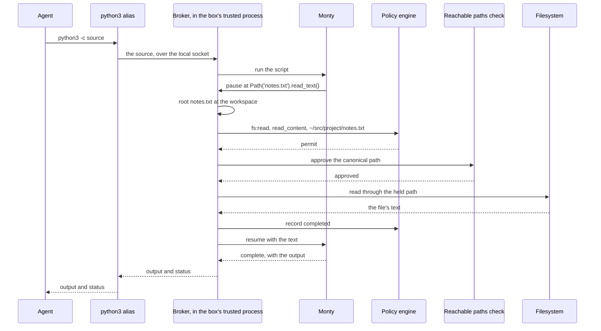

# How Box runs Python scripts

Box's Python is [Monty](https://github.com/pydantic/monty), an interpreter for a subset of Python,
written in Rust by Pydantic. Monty does no I/O of its own. Each file operation a script makes
pauses the interpreter, Box asks policy about it, and Box performs only what policy permits. A
script reaches the network through one function, `fetch()`.

| Monty | What it does |
|---|---|
| Runs in | The box's trusted process, beside the policy engine. One Monty instance for each script, with no state kept between scripts. |
| Is reached by | The `python3` or `python` alias, or a `python` command typed in Strands Shell. |
| Decides | `fs:read`, `fs:write`, `fs:delete`, or `fs:move` for each file operation. It raises no other action. |
| Reaches the network through | `fetch()`, which sends each request to the egress gateway. The gateway decides `net:connect` and `http:request`. |
| Refuses | Environment reads, `Path.resolve()`, `Path.absolute()`, `mkdir(parents=True)`, and every module Monty doesn't implement, whatever the policy says. |

The box's trusted process runs outside the agent's sandbox. It holds the policy engine, the
broker, which accepts the agent's requests to Box's interpreters, and the egress gateway, which
checks and forwards every outbound request. The reachable paths check is deny-only and runs after policy. It
refuses the box directory, the `box.toml` and policy this run loaded, and any path outside the
operator's home, the agent's `HOME`, and the workspace.

For the Python that Monty supports, the file operations, `fetch()`, and the rules to write, read
[Python scripts in a box](../user/monty.md).

## Why a script can't act on its own

**Monty has no I/O.** It parses Python with Ruff's parser and runs it on its own bytecode
interpreter, with no CPython underneath. Every call a script makes that would touch the
surrounding OS, such as `open()`, `Path.read_text()`, or `os.listdir()`, pauses the interpreter and
hands the call to Box. Box decides it, performs it or refuses it, and resumes the script with the
result. `import subprocess` raises `ModuleNotFoundError`, so a script can't start a program either.

**The workload never holds Monty.** A process in the agent's sandbox reaches Monty only through an
alias, a client program in the sandbox that forwards a request over a local socket. The broker
runs the script and returns its output and its
exit status ([an interpreter runs beside the workload, never inside
it](decisions.md#interpreters-are-brokered-aliases)). A tool's sandbox gets no alias, so a
`python3` that a tool runs is the host OS's Python, not the box's Python.

**What it costs.** Monty runs a subset of Python. A script that needs a package from PyPI, or a
module Monty doesn't implement, fails at its `import`.

## The two routes to Monty

The agent reaches Monty two ways, and Box decides both with its one policy engine, as the same
principal ([a workload reaches Monty two ways](decisions.md#python-in-the-shell-is-monty)):

| | The `python3` or `python` alias | `python` or `python3` typed in Strands Shell |
|---|---|---|
| Example | The harness runs `python3 -c "print(6*7)"` | The agent's shell command is `python3 report.py` |
| Command-level decision | None | `shell:exec`, with `program` set to the name typed |
| How the script file is read | The alias reads it, with the agent's own access, before it sends the source | Strands Shell reads it, and policy decides an `fs:read` on it |
| Effects of the script | `fs:*` for each file operation | The same |

**A bare `python` is always Monty.** In Strands Shell, `python` and `python3` are the Shell's own
commands, so they run Monty, the box's Python, even when the operator's `PATH` holds the host OS's Python, and
`python3 --version` prints `Monty (Strands-Box Python subset)` ([a bare `python` name always means
Monty](decisions.md#a-bare-python-name-always-means-monty)).

**A script reads no input.** The broker gives a Python program no stdin and forwards no signals to
it, and `input()` raises `NameError`. In Strands Shell a `python` with no `-c` and no
script file is refused rather than opening a REPL.

## How Box decides a file operation

Each file operation a script makes passes through five steps, in this order ([Monty is judged at the
effect level alone](decisions.md#monty-is-judged-at-the-effect-level-alone)).



1. **Root the path.** A relative path is rooted at the workspace, the directory `[agent] workspace`
   names, so `notes.txt` means the same file it means in Strands Shell.
2. **Ask policy.** Box asks the policy engine for one `fs:*` decision on the rooted path, with an
   `operation` that says which kind of access it is. A path under the operator's home reaches policy
   as `~/<relative path>`, the same spelling Strands Shell uses. A denial resumes the script with a
   `PermissionError`, which it can catch like any Python error.
3. **Approve the canonical path.** After policy permits, the reachable paths check inspects the path's canonical
   form, with every link resolved. It refuses the box directory, the `box.toml` and policy this run
   loaded, anything outside the operator's home and the workspace, and any spelling that isn't its
   own canonical path. A permit can't widen it ([the policy is the only decision
   authority](decisions.md#the-authored-policy-is-the-only-decision-authority)), and its refusal is
   also a `PermissionError`.
4. **Act on the approved path.** Box walks the approved path from `/`, one directory at a time,
   following no symbolic link, and acts on the last path component inside the directory it holds
   open. A directory
   or a file the workload swaps for a link after the approval is never followed.
5. **Record the outcome.** Box records how the operation ended in the policy history, so a history
   rule can count completed reads, or close egress after a read
   ([what a history rule sees](./policy.md#what-a-history-rule-sees)).

**A rename is two paths.** `Path.rename()` reads the source, moves it, and replaces whatever the
destination names. Box asks `fs:read` and `fs:move` on the source, `fs:delete` on an existing
destination, and `fs:move` on the destination, and the reachable paths check approves both paths ([an
overwriting rename also raises a
delete](decisions.md#an-overwriting-rename-also-deletes-the-destination)).

## What Monty performs, and what it refuses

Box performs a file operation only when a rule can name it, and when its result reveals nothing a
rule didn't permit ([Monty performs an effect
only when policy can govern it](decisions.md#monty-performs-only-effects-the-box-can-govern)).

**Performed:** reading and writing text and bytes, appending, `open()`, listing a directory, `stat`
and the existence and type tests, creating one directory, removing a file or an empty directory,
and renaming. An `open()` returns a handle, and each later read or write on it pauses the
interpreter again and is decided again, so a handle can't reach a path its own decision didn't.

**`stat` hides account identity.** A `stat` result carries the real size and file type, and
reports the user ID and group ID as `0` and the link count as `1`.

**Refused, whatever the policy says:**

- **`Path.resolve()` and `Path.absolute()`** return a path to the script. Box asks policy for an
  `fs:read` on the path first, so the attempt reaches the history, and then refuses the call with a
  `RuntimeError` that says it's not supported.
- **`os.getenv()` and `os.environ`** raise a `RuntimeError`. No policy action names an environment
  variable, and the agent's environment holds the placeholders that stand in for credentials.
- **`mkdir(parents=True)`** raises a `PermissionError`, because one decision on the last directory
  can't bound the directories it would create above it. A script creates each level with its own
  `mkdir()`.

## Time and randomness

**The clock is UTC.** `datetime.now()` returns the current time in UTC, with no zone, and
`date.today()` is the UTC date, where CPython uses the local zone. `time.time()`, the monotonic
clock, `os.urandom()`, and `time.sleep()` take no policy decision, because none of them touches a
resource a rule could name.

## How a script reaches the network

`fetch()` is the only network call a script has, and Box sends each request to the egress gateway
([how Box controls outbound traffic](./egress.md)). Monty adds no decision of its own: the gateway
decides `net:connect` and `http:request`, for a script as for the agent's own traffic.

Before it sends anything, Box refuses a URL that names a local or private address, with the same
check `curl` in Strands Shell uses, and the request trusts only the gateway's certificate authority
([how traffic reaches the gateway](./egress.md#how-traffic-reaches-the-gateway)). Box reads at most
1 MiB of a response body, and a larger body raises an `OSError`.

**A refusal reaches the script as a response.** When `http:request` refuses a request, the script
gets an ordinary response with status `403`, the header `x-strands-box-egress: refused`, and a body
that says why. Strands Shell turns that response into an error for `curl`, and Monty doesn't turn
it into an exception ([a gateway refusal never reaches the workload as a successful
response](decisions.md#a-gateway-refusal-never-reports-success)).

## Limits and exit statuses

**One instance for each script.** The broker builds a new Monty instance for each script and drops
it at the end, so a variable one script sets is undefined in the next ([no interpreter state
crosses a call boundary](decisions.md#no-state-crosses-a-call-boundary)). Two scripts can run at the
same time.

**Box bounds each script:** the number of calls Box answers for it, its total sleep, and the size
of one allocation ([Monty handles one request per VM, and bounds each
allocation](decisions.md#monty-is-per-request-and-buffers-its-output)). A script that passes a bound
raises a Python exception, and the box keeps serving. The values are in [limits and exit
statuses](../user/monty.md#limits-and-exit-statuses).

**The exit status says who failed.** `0` means the script completed. `1` means it raised an
exception it didn't catch: a policy denial, a bound, a `NameError` for a name Monty doesn't define,
or a bug in the script. `125` means Box didn't run the script to its end: Box failed, or the script
ran longer than the alias waits for it ([a suspension Box doesn't service is a Python
error](decisions.md#an-unserviced-suspension-is-a-python-error)).

## Example: the write, and two refusals

The diagram above follows the read in this script. The workspace is `~/src/project`, and it holds
`notes.txt` and an empty `out` directory. `policy.dw` permits `fs:read` under the workspace and
`fs:write` under `out`.

```sh
python3 -c "from pathlib import Path
text = Path('notes.txt').read_text()
Path('out/notes.txt').write_text(text.upper())
print('wrote', len(text))"
```

1. **Compute.** After the read, `text.upper()` runs inside Monty, and pauses nothing.
2. **Write.** `write_text()` pauses Monty. Box roots `out/notes.txt` at the workspace, and policy
   permits `fs:write` with operation `write_content` on `~/src/project/out/notes.txt`.
3. **Approve and act.** The reachable paths check approves the canonical path, Box writes the file through
   the directory it holds open, and records the write as completed.
4. **Return.** The script prints `wrote 18`, and the alias exits `0`.

**If the script writes `notes.txt` instead:** no rule permits `fs:write` on it, so policy denies
it at step 2. Box resumes the script with `PermissionError: policy denied this operation on
'<path>' [default-deny]`, the file is unchanged, and the alias exits `1`. A script that catches
the `PermissionError` carries on, and exits `0`.

**If `notes.txt` is a link to `~/.aws/credentials`:** policy permits the read, because the rule
reads the path as text. The reachable paths check refuses it, because `notes.txt` resolves to a different
path, and the script gets a `PermissionError` that names the path of `notes.txt`, not the file
behind it. The check refuses a write through a link the same way, even when the link points at a
file that doesn't exist yet.

## Residual risk

- **Monty runs in the box's trusted process.** That process holds the policy engine, the certificate
  authority key that the egress gateway signs with, and the credentials Box resolved, and it's
  outside every sandbox. Monty contains `unsafe` Rust code, so treat a memory defect in Monty as
  code execution in that process ([both interpreters run in the box's trusted
  process](decisions.md#the-interpreters-run-in-the-trusted-process)). Without such a defect, every
  effect still has to come back to Box as a paused call.
- **A script's total memory has no bound.** Box refuses one allocation above 128 MiB, but a script
  that grows in small steps can use all the memory of the box's trusted process.
- **A refusal can read as an answer.** A `fetch()` that the gateway refuses returns a `403`
  response, and a script that doesn't check the status reads a refusal as an answer.
- **One broad rule reaches the operator's secrets.** Monty reaches the whole operator home, so an
  `fs:read` permit with no path condition reads `~/.ssh` and `~/.aws` ([where policy
  sits](./policy.md#where-policy-sits)).

## See also

- [Python scripts in a box](../user/monty.md): what Monty supports, `fetch()`, the limits, and the
  rules to write.
- [How Box contains a process](./containment.md): the agent's sandbox, and the two kinds of
  enforcement.
- [How Box controls outbound traffic](./egress.md): how the gateway decides and forwards a
  `fetch()`.
- [Policy](./policy.md): how the engine decides each request, and the reachable paths check.
