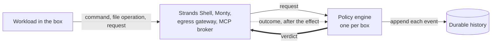

# Policy

Policy is what decides each operation that the box's trusted process performs for the workload. This page explains
where policy sits, how one engine per box makes each decision, what the engine keeps as history, and
what it refuses to load. It's for a security evaluator deciding whether to trust the policy tier,
and for a contributor who changes it. To write a policy and run a box, start with [getting
started](../user/getting-started.md).

## What the Dogwood policy engine provides

Dogwood makes policy decisions from **request details and recorded history**. Box's integrated components (built-in components outside the agent's operating system isolation boundary) submit these requests to the engine.

**Rules for individual actions.** Policies can check file paths, command arguments, and Model Context Protocol (MCP) tool arguments. This lets an operator (the person who configures and runs Box) permit a tool while refusing particular requests to it.

**Rules across actions.** [Dogwood extends Cedar](decisions.md#the-engine-is-dogwood) (a declarative policy language) with temporal rules (rules that use recorded events within a time window). Strands Shell (Box's shell interpreter) and Monty (Box's Python interpreter) share one engine with the egress gateway and MCP broker. The gateway checks outbound network requests; the broker checks and routes MCP requests. Their [shared history](#one-engine-and-its-the-only-authorizer) lets a rule connect a local file operation with a later network request.

**For example:** an operator can write a policy that refuses web requests for five minutes after Monty reads a designated file. The same web request can pass before that read and fail afterward. Box enforces the rule when the request occurs.

These rules use events that Box's integrated components submit. A file read through the agent's own system calls does not enter this policy history. Its filesystem grants (paths and their allowed access) still determine whether the operating system permits that read.

## Where policy sits

A box has two enforcement tiers. The sandbox grants come from `box.toml`, and Box fixes
them before the first process starts. They bound the system calls the workload makes itself. Policy
comes from `policy.dw`, written in Dogwood, a superset of Cedar that adds history rules ([the policy
language is Dogwood](decisions.md#the-engine-is-dogwood)). It decides each request the workload
makes through the box's trusted process: a command or file operation in Strands Shell, the box's shell; an
`os` call in Monty, the box's Python; an outbound connection or HTTP request through the egress
gateway; and a message to an MCP server.

Each tier covers its own route. When a list in `[agent.filesystem]` grants a path, the workload
reaches it directly, and policy never sees that access ([a direct grant replaces the policy
decision](decisions.md#a-direct-grant-replaces-the-policy-decision)). The same goes for what a tool or a
local MCP server does on its own, inside its own sandbox ([a tool reaches only the paths its own
lists name](decisions.md#a-tool-reaches-only-the-paths-its-own-lists-name), [a stdio MCP server runs
contained](decisions.md#a-stdio-mcp-server-runs-contained)). In the other direction, a
`permit` never changes what the workload's own system calls reach.

Reach through the box's trusted process is wide, though. The two interpreters, the Shell and Monty, can
name anything under the operator's home, so one `fs:read` permit with no path condition reads
`~/.ssh` and `~/.aws` through either of them. This is the widest exposure in the product, and the
one floor beneath policy, the reachable paths check described below, never names those paths ([no credential
floor sits beneath the
interpreters](decisions.md#no-credential-floor-sits-beneath-the-interpreters)).

## One engine, and it's the only authorizer

Each box runs exactly one policy engine, inside its own trusted process, and every caller asks that
engine ([a box has exactly one policy engine](decisions.md#one-policy-engine-per-box)). One engine
means one history, so a rule can key a network decision on something the workload read through the
Shell. With two engines, that rule would load in both and fire in neither. Every decision runs
in-process, behind one lock, with no network call ([every decision is local and
in-process](decisions.md#every-decision-is-local-and-in-process)). The engine itself is the
published Dogwood engine, pinned to an exact version, and everything Box adds around it sits behind
one facade ([the policy crate exposes one
facade](decisions.md#the-policy-crate-exposes-one-facade)).

The policy is the only thing that can say yes. Nothing is compiled into the engine, so an empty or
absent policy denies everything. Rules compose under deny-overrides: a `forbid` beats a `permit`,
and a request no `permit` matches is denied. So a `permit` can only widen, and every restriction,
including a cap or a rate limit, has to be a `forbid` ([composition is
deny-overrides](decisions.md#deny-overrides-composition-with-no-compiled-rule-tier)).

Every other check on a mediated path is a deny-only floor. A floor can refuse what policy permits,
and it can never permit what policy refused ([the policy is the only decision
authority](decisions.md#the-authored-policy-is-the-only-decision-authority)):

- **The reachable paths check** runs in the Shell and Monty after the engine. It refuses the box directory,
  the `box.toml` and policy this run loaded, and anything outside the operator's home and the
  workspace. Policy decides first, so a counting rule still sees the attempt, and the refusal is
  recorded beside policy's verdict.

Cloud metadata protection comes from the operator's policy. The gateway asks policy about
the destination before name resolution and about each resolved address before it connects.
It has no built-in metadata block
([cloud metadata protection is policy](decisions.md#the-ssrf-and-metadata-floor-is-compiled-beneath-policy)).
The [egress guide](egress.md#cloud-instance-metadata) describes the required rules.

## How a request is decided

Each caller asks about its own boundary, and the action name says which boundary that is.

Both interpreters use the same `fs:*` actions ([one principal, one resource, and the action scopes
the rule](decisions.md#one-principal-one-resource-and-the-action-scopes-the-rule)):

| Caller | Actions |
|---|---|
| Strands Shell | `shell:exec` or `shell:spawn` per command line, and `fs:read`, `fs:write`, `fs:delete`, or `fs:move` per file operation |
| Monty | `fs:read`, `fs:write`, `fs:delete`, or `fs:move` per `os` call |
| Egress gateway | `net:connect`, `http:request`, and `mcp:call` with its per-tool action for a remote MCP server |
| MCP broker | `mcp:call` with its per-tool action for a local MCP server |

The Shell asks once per command line, after it has resolved the program, and then once per file
operation the command makes, on the resolved path ([the Shell asks policy at two
levels](decisions.md#the-shell-checks-policy-at-two-levels)).

A decision isn't a pure query. The engine appends the request to the durable history first, then
evaluates the rules, and the append is on disk before the verdict returns. After the operation runs,
the caller records how it ended. Only these trusted callers write history, and the workload never
does ([only trusted enforcement points submit
history](decisions.md#only-trusted-enforcement-points-submit-history)).

## What a history rule sees

A history rule, which Dogwood calls a temporal rule, is an ordinary `permit` or `forbid` with a
`when temporal { … }` clause ([a temporal rule rides the same closed
context](decisions.md#temporal-rules-ride-the-closed-context)). For each action, the history holds
three kinds of event:

- **`::request`** for every attempt, whether it was allowed or denied.
- **`::response`** for an operation that happened, or may have happened.
- **`::error`** for an operation that definitely didn't happen.

Each caller fills in the outcome from what it saw. A filesystem response carries `output.result` as
`completed`, `descriptor_issued`, or `indeterminate`, so a rule that counts certain completions can
leave the other two out. A shell response carries the command's exit status as `output.status`, and
a command that a signal killed records 128 plus the signal number, so a rule can require a passing
test before it permits a commit. A connect that definitely failed is a `::error`, and one that may
have opened a socket is a `::response`, so a rule can count failed connects, and a cap on connects
still counts the uncertain ones.

Because a denied attempt is still a `::request`, asking and being refused satisfies a precondition
keyed on `::request`. Key a precondition on `::response` instead ([temporal rules are enforced
against recorded history](decisions.md#temporal-rules-are-enforced-against-recorded-history)).
Counting differs the same way. Each request is appended under the one lock before the next is
decided, so a `::request` count includes every earlier attempt, and a budget keyed on `::request`
admits exactly N attempts, even when they arrive together. A `::response` count only sees operations
that have finished, so several requests in flight at once can each pass before any of them lands.

A `when temporal` clause names one action, with no group, no `or`, and no wildcard, so a budget over
several actions needs one clause per action ([a temporal rule names one
action](decisions.md#a-temporal-rule-names-one-action)). Every window is capped at 24 hours, which
is Dogwood's default, and a longer window refuses to load.

## Durable history

Each box keeps one history file, `<box_dir>/private/dogwood.redb`, and a restart reuses it ([history
is durable per box](decisions.md#history-is-durable-per-box-and-has-no-rewind)). That's what stops a
restart from resetting a budget. The contract has a few parts:

- **Recovery or refusal.** Opening the engine recovers the history in full, or the run fails. The
  box never falls back to an empty history. A damaged file refuses the next run and is left as it
  was found. The run also refuses when the box's record says it has run before but the history is
  missing or empty, and when a history exists but the record says the box has never run.
- **A policy edit is prospective.** A history rule that is unchanged across the edit keeps its
  state, and a new or changed one starts empty.
- **The engine owns time.** It stamps each event from the system clock, and no caller can supply a
  timestamp. If the clock steps backwards, timestamps keep moving forward, so rolling the clock back
  doesn't free a budget. The cost is that a restriction can outlast its window a little.
- **A storage fault denies.** If an append fails, the decision is a deny, and so is every decision
  after it. When recording an outcome fails, the caller warns on stderr and nothing retries it.
- **The file stays bounded.** The engine checkpoints as events accumulate and prunes what falls
  outside the deepest window, so the file's size tracks that window, not the box's lifetime.

The contract leaves things out on purpose. The history has no tamper evidence and isn't an audit
record. It has no rewind, and no box shares it. Nothing commits an operation and its recorded
outcome together, so if the process stops between the two, a `::response` count comes up short.

## What refuses to load

A policy that's wrong stops the box. An inert `forbid` is a fail-open that passes review, so the
load does two things: it strict-validates every name against the closed action vocabulary ([the
action vocabulary is closed and strict-validated at
load](decisions.md#the-action-vocabulary-is-closed-and-strict-validated-at-load)), and it refuses
every rule it can prove will never fire ([a rule that can't fire is refused at
load](decisions.md#a-rule-that-cannot-fire-is-refused-at-load-and-an-uncertain-one-warns)).

The `run` verb validates the policy before it writes any box state. A box with no local MCP server
validates against the complete action schema, and that check accepts and refuses exactly what the
later load does, so a policy that passes it loads at the next run.

A box with a local MCP server can finish the check only after the server reports its tools. Up
front, `run` checks syntax, macro expansion, and provider use. The per-tool actions don't exist
until a server reports its tools, so `run` stages each server's schema as it arrives and validates
the whole policy once more when every server has reported. Until then a tool call for that server is
denied without reaching the engine ([discovery serves the schema-independent
subset](decisions.md#discovery-serves-the-schema-independent-subset)). A server whose tool listing
the policy refused degrades alone: its per-tool rules don't load, and the box starts without them
([a server whose discovery a policy denies degrades
alone](decisions.md#a-server-whose-discovery-a-policy-denies-degrades-alone)).

A policy that validates can still fail to run, because opening the history has its own refusals;
[durable history](#durable-history) lists them.

The inert-rule check sorts each rule into one of three classes:

- **Refused:** anything the load can prove inert. An action or field the schema doesn't declare, a
  path literal no reported path can match, one `@id` on two rules, and a cap written as a `permit`
  beside an unconditioned `permit` for the same action, which can't narrow it.
- **Warned:** a rule that might be inert, such as a `program` literal spelled as a path, or that cap
  beside a conditioned `permit`.
- **Loads anyway:** two shapes the validator can't prove inert, a comparison between two different
  enum types, and a `has`-guarded read of `context.output` outside a `when temporal` clause.

A refusal names the rule and says what to write instead.

## Residual risk

Beyond the credential exposure in [where policy sits](#where-policy-sits), an evaluator should know
about these:

- **Decisions serialize.** Every decision waits for one disk sync and for the one lock, so a burst
  of requests queues behind itself.
- **A temporal macro can lose its history.** In Dogwood 1.0.0, a rule that calls a temporal macro
  such as `count_within` loses its accumulated state when the text before the call changes, even by
  a comment. A rule written inline keeps its state. Nothing Box ships calls a macro.
- **No human approval.** A verdict is allow or deny, and no rule can pause a request for a person
  ([there is no approval verdict](decisions.md#there-is-no-approval-verdict)).
- **A denial teaches.** A refusal names the component, the reason, and the rule, so a workload can
  learn the shape of the policy from what fails ([a refusal names the component, the reason, and the
  rule](decisions.md#a-denial-names-the-rule-that-refused-it)).
