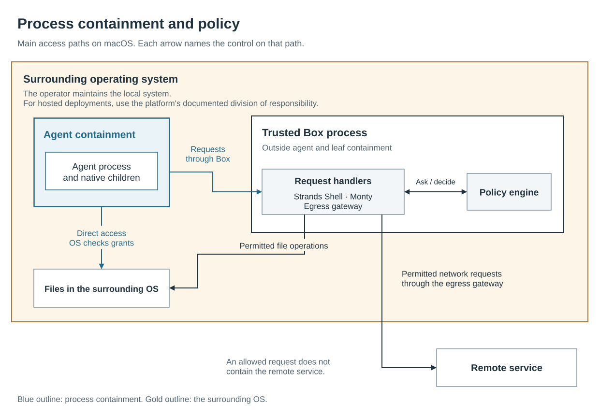

# Security model and shared responsibility

Strands Box restricts a workload: the processes that run in a box. Its security depends on
Box's enforcement, the operator's access choices, and the surrounding operating system (OS).
The operator is the person who configures and runs Box.
This page explains what Box enforces, where its protection ends, and who owns each part.

Box treats the workload as hostile, including when it runs an agent that follows malicious
instructions ([the workload is hostile by assumption](decisions.md#the-agent-is-hostile)).
Box aims to protect the operator's files, credentials, and connected systems by restricting
that workload's access. The protection runs outward.
It does not protect the workload's contents from that OS
([the direction of protection](decisions.md#box-protects-the-machine-not-the-box)).

## What Box enforces and where protection ends

Box builds and applies a set of sandbox grants: the restrictions on a process's direct access.
Its trusted process, which runs outside every sandbox, handles requests on the workload's
behalf. Policy is the operator's rules for access on those request paths.

Strands Shell and Monty are Box's shell and Python interpreters. The diagram shows the agent's
main access paths on macOS. Tools and local MCP servers have separate sandboxes, described below.
The [editable diagram](images/security-enforcement.drawio) preserves the shapes and connections.

### Processes and files

On macOS, Box applies the sandbox before the configured program starts. If that step fails,
the program does not start under weaker restrictions
([failed setup refuses the workload](decisions.md#every-failed-or-unsupported-apply-refuses-the-workload)).
Processes that the contained program starts inherit its restrictions
([children inherit the boundary](decisions.md#children-inherit-the-boundary)).
The [containment guide](containment.md#what-a-box-guarantees) scopes these guarantees and explains
the platform dependencies.

A direct filesystem grant is standing access. Policy does not decide each use, and a policy
refusal cannot revoke that grant
([a direct grant replaces the policy decision](decisions.md#a-direct-grant-replaces-the-policy-decision)).
Requests through the box's trusted process take a separate path: policy can permit access beyond the
workload's direct grants. The
[two enforcement paths](containment.md#two-kinds-of-enforcement) show this difference.

### Outbound network access

The egress gateway checks policy before it forwards connections and web requests.
An allowed destination can receive data the workload can read. Permission to contact a service
does not establish that the data sent to it is safe to disclose
([allowed actions can still cause harm](limitations.md#allowed-actions-can-still-cause-harm)).

A tool or local server with a declared network exception can connect without gateway checks,
credential injection, or gateway traffic records
([native egress](decisions.md#native-egress-is-an-operator-declared-leaf-escape)).
Cloud metadata protection also depends on the operator's policy. The egress gateway has no built-in metadata
block ([metadata protection is policy](decisions.md#the-ssrf-and-metadata-floor-is-compiled-beneath-policy)).
The [egress guide](egress.md#cloud-instance-metadata) describes the required restrictions.

### Credential values and credential use

For credentials sourced from environment variables, Box gives contained processes a placeholder
and keeps the real value in its trusted process. The gateway inserts the value into permitted
requests ([placeholder credentials](decisions.md#the-workload-holds-a-phantom-and-the-gateway-holds-the-secret)).
The agent, each tool, and each local MCP server share credential routes. A tool's or local MCP
server's sandbox contains a program that Box starts. These processes can use the same credentials
through permitted requests
([the box is the credential boundary](decisions.md#the-box-is-the-credential-boundary)).

Hiding the value does not prevent credential use. It also does not protect credential files that
the operator exposes through direct grants or policy
([broad interpreter access](policy.md#where-policy-sits)).
The [egress guide](egress.md#how-credentials-are-added) explains the route and injection rules.

### Policy history and audit coverage

Policy history covers requests that reach the policy engine. A direct file operation raises no
policy decision, so a later rule cannot use that history to detect the read.
Policy history is not a complete audit record. It provides no evidence of tampering.
An operation can finish without a recorded outcome if Box stops before recording it
([history limits](policy.md#durable-history)).
The operator must assess whether the available records meet the deployment's audit needs.

### Remote services and code executed elsewhere

Box can control a request to a remote service, but it cannot contain that service or control
its actions after an allowed request. The operator decides whether to trust it with the data
sent ([remote servers](containment.md#remote-mcp-servers)).
The sandbox also does not govern code the workload writes and someone later executes outside
Box ([authored code](decisions.md#containment-does-not-govern-authored-code)).

## Box owns enforcement

Box owns correct enforcement of direct restrictions and policy on requests through its trusted process.

The box's trusted process also depends on correct implementation. Its position outside every sandbox
lets it perform permitted operations, but leaves its own defects outside that protection
([the box's trusted process can itself be wrong](decisions.md#some-channels-never-reach-enforcement)).
Disclosing this dependency does not exclude a bypass in that process from security reporting.

## The operator owns access choices

The operator selects the workload, its direct access, and the policy for requests through Box.
These choices include network exceptions and which programs may use the box's credentials.
The operator must assess the combined access through direct grants and requests to Box.

An allowed action can still cause harm. The operator owns whether that access fits the task,
and the protection and recovery of data exposed by it. The
[limitations page](limitations.md#how-access-choices-change-the-risk) describes the consequences
of broad grants and other access choices. The
[user security page](../user/security.md) explains which configuration controls to review.

## The operator and platform own the environment

Box relies on the surrounding OS to enforce process restrictions. The operator owns the
security of a local system, including its accounts, installation, configuration, and updates.
A compromised OS can defeat those restrictions
([kernel exploits are outside Box's scope](tenets.md#non-goals)).

For a hosted deployment, responsibility for the surrounding environment follows the guarantees
that the selected platform documents. Box supplies no isolation guarantee between tenants
([tenant isolation is the platform's responsibility](tenets.md#non-goals)).
Its sandboxes cannot establish that guarantee for a platform.

This example assumes the platform provides isolation between tenant environments. It does not
specify a deployment technology or extend Box's guarantees. The
[editable diagram](images/security-platform.drawio) shows the same arrangement for both tenants.

The operator must obtain required resource controls from the surrounding environment. The
[limitations page](limitations.md#protections-box-doesnt-provide) states the other protections
to assess for that deployment.

## Identify the control that failed

Suppose the workload reads a file. If its direct grant allows that read, the result follows the
operator's access choice. If Box permits a read outside that grant without another authorized
path, the result indicates an enforcement defect.

The same distinction applies to requests through the box's trusted process. A broad policy permit
can authorize an unwanted operation. An implementation that bypasses the applicable policy is
a Box defect.

The [Security Policy](../../SECURITY.md#reporting-security-issues) gives vulnerability reporting
instructions, including a private channel for suspected enforcement bypasses.
