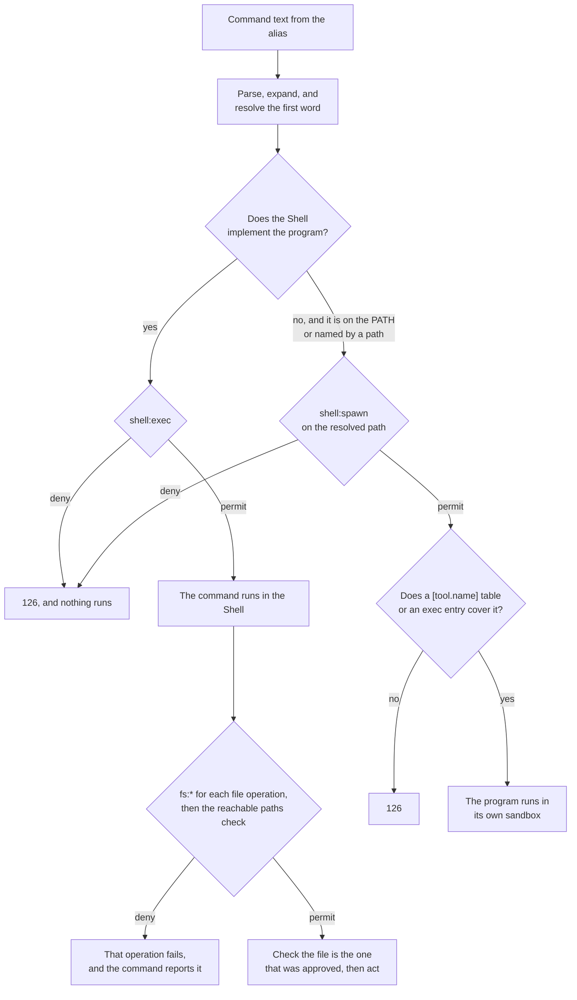

# How Box runs shell commands and programs

When the agent runs `zsh -c "…"`, the command doesn't run in the host OS's shell. It runs
in [Strands Shell](https://github.com/strands-agents/shell), a shell interpreter that runs in the
box's trusted process, outside the agent's sandbox. Policy decides each command, and each file operation the
command makes. A program the Shell doesn't implement runs in its own sandbox, separate from the
agent's.

| Inside a command, the agent runs | Policy decides | Where it runs |
|---|---|---|
| A command the Shell implements, such as `cat`, `grep`, or `curl` | `shell:exec`, then an `fs:*` action for each file operation | In the Shell, in the box's trusted process |
| A program on the operator's `PATH`, such as `git` | `shell:spawn`, on the program's resolved path | Its own sandbox |
| A program the agent built, such as `./target/debug/app` | `shell:spawn`, on the program's resolved path | Its own sandbox |

**Box uses Strands Shell because it already implements what a harness needs:** the parser,
pipelines, control flow, and common commands, with a shell's usual exit statuses, output streams,
and argument conventions. The difference is that each file operation is a call that Box intercepts
before it acts ([Box runs Strands Shell, never the host OS's
shell](decisions.md#interpreters-are-vendored-not-the-host-shell)).

An **alias** is a small client program in the agent's sandbox, named `zsh`, `bash`, or `sh`, that
forwards a command to the box's trusted process over a local socket. The **broker** is the part of
that process that accepts the alias's connection and hands the command to the Shell. The **reachable paths check**
is deny-only and runs after policy: it refuses a path outside the operator's home, the agent's
home, and the workspace, a path inside the box directory, and the `box.toml` and policy this run
loaded, whatever a `permit` says.

## How a command reaches the Shell

**The alias is the agent's only route to the Shell.** The agent finds `zsh`, `bash`, and `sh` on
its `PATH`, and each is the alias ([an interpreter runs beside the workload, never inside
it](decisions.md#interpreters-are-brokered-aliases)). For a script, the alias reads the file in the
agent's sandbox, under the agent's own filesystem grants, and sends its text. Policy judges that
text, never the file name. A tool's sandbox gets no alias and can't connect to the broker, so a
`bash` that a tool runs is the host OS's `bash`, inside that tool's sandbox.

**Each command starts clean.** The alias sends one command and closes, so a variable exported in
one `zsh -c` is unset in the next.

## How the Shell decides a command

The Shell parses the command text, expands every word, and resolves the first word of each command
before it asks policy anything. Only then is the real program known: a shell `alias` definition, a
variable, or a quoting trick has already collapsed into the words that will run.

Policy then decides at two levels: once for the command, and once for each file operation it makes
([the Shell asks policy at two levels](decisions.md#the-shell-checks-policy-at-two-levels)). These
actions decide what a command does:

- `shell:exec`, for a command the Shell implements ([commands the Shell
  implements](#commands-the-shell-implements)).
- `fs:read`, `fs:write`, `fs:delete`, and `fs:move`, for each file operation that command makes
  ([file operations](#file-operations)).
- `shell:spawn`, for a program outside the Shell ([programs outside the
  Shell](#programs-outside-the-shell)).
- `net:connect` and `http:request`, for each request `curl` sends, decided by the egress gateway
  ([network requests](#network-requests)).

A rule on any of them can also add a history clause ([history rules](#history-rules)), and the
[reference](../user/shell.md#shellexec) lists every field each action carries.

`shell:exec` and `shell:spawn` are separate actions, and each command raises exactly one of the
two, so a `permit` on `shell:exec` with no condition still grants no program outside the Shell.

**Write rules on `program` and on paths, not on the command text.** `context.input.command` is the
command line rebuilt from the expanded words, and one effect has many spellings ([one admission
point judges every route](decisions.md#one-admission-point-after-resolution)).



### Commands the Shell implements

**A command the Shell implements raises `shell:exec`.** That covers its builtins, shell functions
the command defines, and its own commands, such as `cat`, `grep`, `jq`, and `curl` ([the full
list](../user/shell.md#what-runs-where)). A `python` or `python3` typed in the Shell runs in Monty,
Box's Python interpreter ([a workload reaches Monty two
ways](decisions.md#python-in-the-shell-is-monty)).

**The Shell's own command wins over a program of the same name.** `echo` is the Shell's `echo`,
even though `/bin/echo` is on the `PATH`, so a rule on `shell:exec` always means the Shell's own
commands.

**A rule reads the command's name and its arguments.** Use `context.input.program` to allow or
refuse a command by name, and `context.input.arg1`, `arg2`, or `arg_count` to narrow it by its
arguments.

```cedar
forbid (principal, action == Box::Action::"shell:exec", resource)
when { context.input.program == "curl" };
```

**Every route that runs command text gets its own decision.** Command substitution, `eval`, `.`
and `source`, `sh <file>`, an `EXIT` trap, `find -exec`, `xargs`, and Lua's `io.popen` and
`os.execute` all reach the same decision point. So `find -exec` over ten matches is eleven
decisions: the `find`, and one for each command it runs.

### File operations

**Each file operation the command makes is one `fs:*` decision,** on the path the Shell resolved,
with every symbolic link followed. Reading, listing, `cd`, and checking whether a file can run are
`fs:read`. Writing, creating a directory, `chmod`, and `ln -s` are `fs:write`. Removing a file or a
directory is `fs:delete`, and a rename is `fs:move`.

**A rule reads the path and the kind of operation.** Use `context.input.path` to scope reach to a
directory. Use `context.input.operation`, which names which of the operations above it was, to
allow listing a directory without allowing reads of its files, or to refuse `chmod` without
refusing other writes. A path under the operator's home reads as `~/…`, so a policy checked into a
repository holds in every clone.

```cedar
permit (principal, action == Box::Action::"fs:read", resource)
when { context.input.path like "~/src/project/*" };

forbid (principal, action == Box::Action::"fs:write", resource)
when { context.input.operation == Box::FsWriteOperation::"set_permissions" };
```

**Paths outside the operator's home, the agent's home, and the workspace are in memory.** The Shell
binds those three directories to their real paths, so a write there lands on disk. Every other
path, such as `/tmp`, exists only in the Shell's own memory, and policy still decides each operation
on it. That memory belongs to one command, so a file written to `/tmp` is gone after the command
ends.

**The reachable paths check runs after policy,** so a history rule still sees an attempt the check refuses,
and the decision log records that refusal as the check's.

**The Shell acts on the file it checked.** The resolved path carries the identity of the file it
named. Just before the operation, the Shell checks that identity again and refuses on a mismatch,
so a symbolic link swapped in after the decision can't divert the operation. A write keeps the file
it opened ([a resolved token binds the object it
names](decisions.md#a-resolved-token-binds-the-object-it-names)).

**The reachable paths check doesn't protect credentials.** The Shell can name anything under the operator's
home, so an `fs:read` permit with no path condition reads `~/.ssh` and `~/.aws`. Scope every
`fs:read` permit to a path ([where policy sits](./policy.md#where-policy-sits)).

### Programs outside the Shell

**A program the Shell doesn't implement raises `shell:spawn`.** A bare name is looked up on the
`PATH` of the box's trusted process, which is the `PATH` of the host OS's shell where the operator ran `box run`, with
`/usr/bin:/bin` as the fallback. A name with a `/` is that path, relative to the Shell's working
directory. Either way, the Shell resolves every link, and `program_path` is the file that will run,
and the program gets the agent's spelling as its `argv[0]` ([a program resolves on the operator's
`PATH`](decisions.md#a-host-binary-resolves-on-the-operator-path)).

**A rule reads where the program lives.** Use `context.input.program_path` to allow a program by
its resolved file, which reads as `~/…` under the operator's home, as a path does. `program` and
the argument fields work as they do for `shell:exec`, so a rule can refuse one subcommand.

```cedar
permit (principal, action == Box::Action::"shell:spawn", resource)
when { context.input.program_path like "~/src/project/target/debug/*" };

forbid (principal, action == Box::Action::"shell:spawn", resource)
when {
  context.input.program == "git" &&
  context.input has arg1 &&
  context.input.arg1 == "push"
};
```

**A permit is not enough to run it.** After `shell:spawn` permits a program, Box picks the
configuration it runs under:

1. **A `[tool.<name>]` table** whose `command` names the same file ([how a table is
   chosen](../user/shell.md#toolname)).
2. **An `[agent.filesystem] exec` entry** that covers the file, and no `deny` entry that covers
   it. The program then runs with the agent's own filesystem lists.
3. **Neither:** Box refuses the program, and the command exits with status 126, even though policy
   permitted it.

The configuration only narrows: it can refuse a program that policy permitted, and it never runs a
program that policy refused. So policy stays the only authority on whether a program runs, and the
configuration decides only the reach it runs with.

**No `fs:*` decision covers what the program does;** its own filesystem lists bound it ([a tool
reaches only the paths its own lists
name](decisions.md#a-tool-reaches-only-the-paths-its-own-lists-name)). The tool's sandbox reuses
the policy engine and egress gateway of the box's trusted process ([one engine and one gateway per
box](decisions.md#a-host-binary-runs-in-a-contained-leaf-box)).
[A tool's sandbox](./containment.md#a-tools-leaf-box) covers what it can reach.

### Network requests

**`curl` sends its requests through the egress gateway,** which decides `net:connect` and
`http:request` for it, as for the agent's own traffic. The Shell raises no network decision of its
own ([the Shell's outbound HTTP goes through the egress
gateway](decisions.md#shell-network-goes-through-the-egress-gateway)), and refuses a URL to
`localhost` or a literal local address before it sends anything ([how traffic reaches the
gateway](./egress.md#how-traffic-reaches-the-gateway)).

**A refusal from the gateway fails the command.** The gateway marks each refusal it writes, and the
Shell turns a marked response into an error, so `curl` exits non-zero and prints no response body.
An error status from the server itself keeps `curl`'s usual meaning ([a gateway refusal never
reports success](decisions.md#a-gateway-refusal-never-reports-success)).

### History rules

**A history rule** adds a `when temporal` or `unless temporal` clause to a rule on any of these
actions. It counts or orders earlier `::request` and `::response` events, and a shell response
carries the command's exit status as `output.status` ([what a history rule
sees](./policy.md#what-a-history-rule-sees)).

```cedar
forbid (principal, action == Box::Action::"shell:spawn", resource)
when {
  context.input.program == "git" &&
  context.input has arg1 &&
  context.input.arg1 == "commit"
}
unless temporal { … };
```

## Exit statuses

A harness reads the command's exit status, so the Shell keeps refusal, failure, and absence apart:
`126` is a refusal, `127` is a program found nowhere, and `125` is a failure of Box itself. A
refused file operation fails the command the way the operation's own error would. The
[reference](../user/shell.md#exit-statuses) lists each status and its message.

## Example: find the to-dos and stage them

Suppose the workspace is `~/src/project`, the operator started `box run` with the Command Line
Tools first on `PATH`, and `box.toml` has a `[tool.git]` table with `command = ["git"]`.
`policy.dw` permits `shell:exec`, `fs:read` and `fs:write` under `~/src/project`, and `shell:spawn`
for `git`. The agent runs:

```sh
zsh -c 'grep -n TODO src/main.rs > todo.txt && git add todo.txt'
```

1. **Alias.** The alias sends the text to the broker, which hands it to the Shell.
2. **Command.** `grep` is the Shell's own command, so policy decides `shell:exec` for `grep -n
   TODO src/main.rs`, and permits it.
3. **Redirect.** The redirect opens `~/src/project/todo.txt`, and policy permits `fs:write`.
4. **Read.** `grep` reads `~/src/project/src/main.rs`, and policy permits `fs:read`.
5. **Program.** `grep` exits 0, so `&&` runs `git`. The Shell doesn't implement `git`, so it finds
   `git` on the operator's `PATH`, and policy decides `shell:spawn` on the file `git` resolves to,
   here `/Library/Developer/CommandLineTools/usr/bin/git`. The policy permits it.
6. **Sandbox.** `[tool.git]` names the same file, so `git add todo.txt` runs in its own sandbox
   under that table's lists. Its reads and writes in `.git` raise no `fs:*` decision.

The decision log shows four decisions:

```text
permit  shell:exec   grep -n TODO src/main.rs
permit  fs:write     ~/src/project/todo.txt
permit  fs:read      ~/src/project/src/main.rs
permit  shell:spawn  /Library/Developer/CommandLineTools/usr/bin/git add todo.txt
```

**If the policy permits no `fs:write`,** step 3 fails:

```text
strands-shell: todo.txt: policy denied this operation on '~/src/project/todo.txt' [default-deny]: No permit policy matched this request.
```

`grep` never reads `src/main.rs`, the command exits 1, and `&&` never starts `git`, so no
`shell:spawn` is decided.

## See also

- [Strands Shell reference](../user/shell.md): what runs where, the fields a rule reads, and the
  exit statuses.
- [Write policy for shell commands](../user/shell-policy.md): rules for commands, programs, and
  paths.
- [How Box contains a process](./containment.md): the agent's sandbox, and the sandboxes for tools
  and local MCP servers.
- [How Box controls outbound traffic](./egress.md): how the gateway decides `curl`'s requests.
- [Policy](./policy.md): how the engine decides each request, and what refuses to load.
