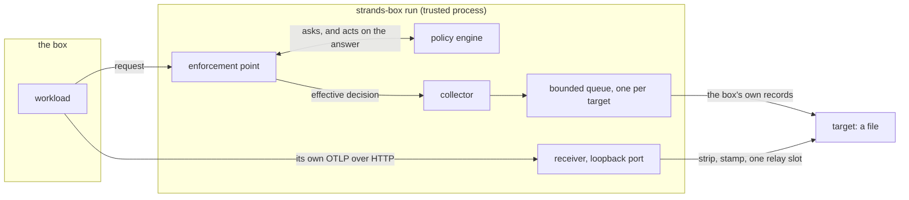

# Telemetry

Telemetry is the record of what a box decided. It is on by default: a box whose operator configured no
telemetry at all still writes a record for every decision it makes. Each record names what the workload
asked for, and whether the box allowed it or refused it.

The workload also has telemetry of its own, and an operator wants both in one place. So the box accepts
OpenTelemetry data from a process it does not trust, and the rest of this page is mostly about how that
stays safe.

## The parts

- The **collector** holds the queues and the targets. It takes each record the box produces.
- The **receiver** accepts the workload's own telemetry on a loopback port, and strips what the workload
  may not claim.
- A **target** is where records go. Today that is a file, appended to one record per line.

All three live in the box's [trusted process](terminology.md), the `strands-box run` process that sits
outside the box and makes every decision. There is no separate collector to install, and two boxes share
no buffer, so one compromised box reaches no other box's audit trail ([one collector per
box](decisions.md#one-collector-per-box-in-the-trusted-process)).

### Collector

Every policy decision reaches the collector. [Policy decides each request the workload makes through the
box's trusted process](policy.md#where-policy-sits), and the enforcement point that asked hands the answer on.

The collector records the **effective** answer rather than the engine's raw verdict ([the effective
decision is the canonical record](decisions.md#the-effective-decision-is-the-canonical-record)). Beneath
the authored policy sit checks that can only refuse, never grant, and one of them can reject what the
policy permitted. One of them subtracts the box's own directory from the paths an interpreter may name, so
a request there is refused whatever a rule says, and a broad read permit still comes back as a denial.
That check belongs to the box's own request path, and it is separate from operating system enforcement, which independently
decides what the workload's own syscalls reach. Recording the engine's verdict would therefore sometimes
describe something that did not happen.

A box writes three kinds of record, under three scopes a reader selects on:

- **Decisions**, under the scope `strands-box.policy`. One per effective answer.
- **Control-plane records**, under the scope `strands-box.control`. One per change to the box's own
  authority.
- **Kernel refusals**, under the scope `strands-box.containment`. One per kind of call the Linux
  syscall filter refused, rate-limited, and not a decision ([a kernel refusal is observed, not
  decided](decisions.md#a-kernel-refusal-is-observed-not-decided)).

A decision names the action, the resource, the verdict, the cause, and every policy that determined it.
Standard OpenTelemetry keys carry the detail for the kind of request: the server address and port, the
request method, the file path, or the resolved command ([the policy attribute names are this product's
own](decisions.md#the-policy-attribute-names-are-this-products-own)). Two standard keys are left out, the
full URL and the full command line, because each routinely carries a credential. For the same reason a
shell record reports an argument the script stated literally, and redacts an expanded one unless it is a
plain flag: a shell holds its arguments after expansion, so `echo $(cat secret.txt)` would otherwise write
the file's contents into the record ([a shell record names only a literal
argument](decisions.md#a-shell-record-names-only-a-literal-argument)). A decision also carries the
caller's trace context, which joins it to the agent's own work. The workload supplies that context, so the
box bounds it, validates it, and never treats it as evidence of authority ([correlation context is a
hint](decisions.md#correlation-context-is-a-hint-and-never-authority)).

There are seven control-plane records, because a box's authority settles as it starts: a policy installed
or refused, a tool vocabulary installed, discovery complete, the box started or stopped, and a launch whose
kernel refusals the box could not observe. They answer which authority was in force at a given moment,
which is why they share a file with the decisions.

Every decision and control-plane record is both a span and a log record, sharing one trace and span
identifier ([every box record is both](decisions.md#every-box-record-is-both-a-span-and-a-log-record)). A
kernel refusal is a log record only: it is not a step of the box's work, and a flood of them would crowd
the workload's own timeline. The log record is the
audit evidence, and the span puts the decision on a timeline beside the workload's own work. The span
marks the instant the decision was submitted, so its start and end are equal.

OpenTelemetry lets a caller mark a trace as not sampled, which asks tools to drop it and keep the volume
of performance data down. **The box ignores that mark for its own decisions and always writes them.** The
workload is what supplies the trace context, so obeying the mark would hand the workload a switch that
makes the record of its own refusals disappear.

### Receiver

The collector asks the kernel for a free loopback port, and the box hands the workload that address in
the standard OpenTelemetry exporter variables ([the collector listens on a second loopback
port](decisions.md#the-collector-listens-on-a-second-loopback-port)). So an unmodified agent SDK exports
to the box with no code change and no credential. The receiver answers three routes, for spans, log
records, and metrics, and `404` on everything else. It **relays** what arrives and produces nothing on the
workload's behalf, so a harness that exports no metric delivers no metric.

The `strands.box.` attribute namespace is reserved ([`strands.box.` is reserved, and the collector strips
it at every level](decisions.md#the-strands-box-namespace-is-reserved)). Before anything can route a
payload, the receiver
removes every attribute under that prefix wherever it sits, renames a scope claiming the box's own
namespace, and stamps each resource as coming from the agent. A resource is OpenTelemetry's block of
attributes naming the producer, and it sits above the scopes and the records inside one payload. The box's
own records are stamped as coming from the box, and that stamp is what a reader checks to tell the two
apart. Two details carry the property. The strip reaches every level a payload nests, and not the resource
alone, because a payload carries a claimed verdict on a record rather than on the resource above it. And
stripping and stamping are one operation, so no route can perform one half without the other.

### Target

A target is a file. Each line is one complete OpenTelemetry request, in the JSON form of OTLP, which is
OpenTelemetry's wire protocol, so a viewer reads the file with no conversion ([OpenTelemetry owns the
schema](decisions.md#opentelemetry-owns-the-schema-and-the-box-owns-its-queues)). Records stay on the
computer that produced them, which is the property the product is built around and the one every shipped
example uses.

A box with no telemetry configuration writes `private/telemetry/records.jsonl` inside its own box
directory ([every box records by default](decisions.md#every-box-records-by-default)). The workload cannot
read, truncate, or delete it, because a refusal beneath policy rejects every path that resolves into the
box directory whatever a permit says.

A declared target replaces that default rather than adding to it, and it also leaves that protection
behind. The box refuses a destination inside the box directory and outside its private tree, and it
refuses a path carrying `..`, but it does not check the destination against the workload's own grants. So
an operator who names a file inside a directory the workload may write has given the workload a file it
can truncate.

An operator may narrow a target to the box's denials, its permits, or the word that selects the
workload's relayed spans ([a target names a set](decisions.md#a-target-names-a-set-of-signals)). **That
last word also selects the control-plane records**, so a target that omits it loses the box's own record
of its authority changes. The workload's relayed log records and metrics arrive whatever the list names.

## What the workload cannot do

**It cannot forge a record.** The strip and the stamp run on every route before any target sees the
payload ([`strands.box.` is reserved](decisions.md#the-strands-box-namespace-is-reserved)).

**It cannot suppress a record the box wrote** ([the two lanes share no
queue](decisions.md#the-agents-lane-and-the-boxs-lane-share-no-queue)). The box's own records go through
one bounded queue per target, and a
relayed payload never enters it: the receiver carries it straight to the target, and only one relay runs
at a time. That single slot is a concurrency token and not a policy permit, and a payload that finds it
taken is dropped rather than queued behind the box's own records.

The separation is what makes that true. One queue carrying both kinds would be a queue the workload can
fill, by exporting its own telemetry fast enough, and a full queue drops what arrives next. The workload
would then erase the record of what the box denied it, by doing nothing more than exporting hard.

**It cannot exhaust the box's memory.** Reading a posted payload costs memory, so the receiver takes the
relay slot before it decodes anything. A payload that arrives while the slot is taken is discarded
undecoded: its bytes are already received, under the cap below, but the expensive work never starts.

Two size limits bound what one accepted payload can cost. The first caps the number of bytes in the
request, and applies before the decode. The second caps how many resources one request may declare,
and applies after the decode, because the count is not known until then. It has to run before the
provenance stamp, which is the costly step: the stamp adds attributes to every resource, so a request
packed with millions of empty ones would turn a few megabytes of input into hundreds of megabytes of
memory.
This is the process that holds the policy engine, the resolved secrets, and the egress gateway's signing
key, so exhausting its memory is worth more to an attacker than it would be in an ordinary server.

**It cannot learn what a target kept.** Every answer carries the same two-byte JSON body, and a payload
the collector drops still answers `200`.

## Limits

- **Delivery is best effort** ([a record can be lost](decisions.md#delivery-is-best-effort)). If a write
  to the target fails, the record is gone: the box does not retry it, and it holds nothing back on disk to
  send later. The loss is not reported either. What is protected is the shutdown drain, which sits at the
  one point every exit reaches, so a box that fails before its workload starts still records that it
  stopped. A relayed payload takes no part in that drain, so a shutdown can lose one in flight. A decision
  cannot be lost that way.
- **The loopback port is reachable by every process running as the operator**, because a loopback
  listener cannot check which process connected. Such a process cannot forge a box record, but it can
  inject noise attributed to the agent.
- **A record file is not tamper evident.** Nothing signs a record and nothing chains one to the next, so
  anything that can write the file can edit it afterwards and leave no trace. Do not read "audit trail"
  as "tamper proof".
- **Only the default destination is out of the workload's reach.** The default file sits in the box
  directory, and two independent things keep the workload out of it. A request the workload makes through
  an interpreter is refused before policy is consulted, because the box subtracts its own directory from
  the set of paths an interpreter may name. A syscall the workload makes itself is refused by its sandbox,
  which never grants that directory, and the box refuses a `filesystem` grant that names it, so no
  configuration can open it either. **A destination the operator names carries no such protection.** It is
  as reachable as the grants around it, and a destination inside a directory the workload may write can be
  truncated by the workload. **Put a declared destination outside every path the workload is granted.**
- **A record file grows without bound.** Nothing in Box rotates or truncates it.
- **A slow target delays the workload's own telemetry**, because one write and its flush to disk hold
  the single relay slot, and nothing bounds the number of connections on the port. The slot bounds
  concurrency rather than rate: the receiver answers only once it has relayed, so a client that waits
  for each answer before it sends again never meets a taken slot, at any volume. A drop needs two
  payloads in flight at the same moment.
- **Two boxes must not share one file.** A long line becomes more than one write, so two writers can
  tear a line. Give each box its own.

## How it fits together

| Part | Takes | Gives |
|---|---|---|
| Collector | each effective decision, and each control-plane operation | one span and one log record per decision, queued per target |
| Receiver | the workload's OTLP over HTTP, on a loopback port | the same payload, stripped and stamped, relayed inline |
| Target | both of the above | one file line per request, in the JSON form of OTLP |

## See also

- [Telemetry reference](../user/telemetry.md): the `box.toml` keys, the keys a record carries, and how to
  read a records file.
- [Policy](policy.md): the engine whose decisions this page records.
- [Decisions](decisions.md): the reason for each part of this design. This page links the load-bearing
  ones at the claim they support, and the `Telemetry` section holds the rest.
- [Terminology](terminology.md): the terms this page uses, such as trusted process, workload, and box
  directory.
